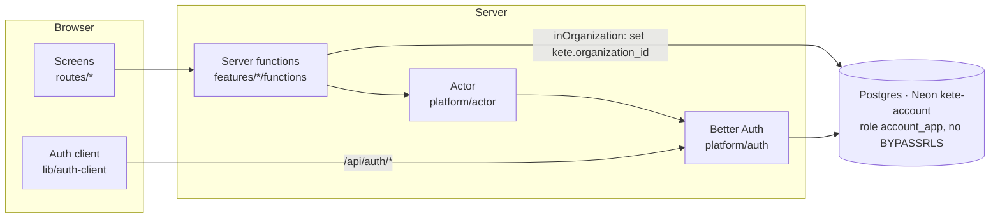
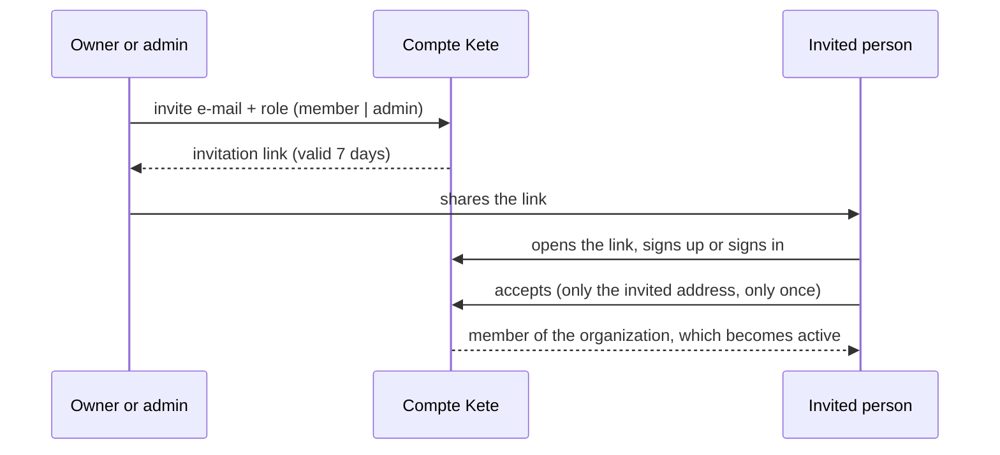

# Compte Kete (`apps/account`)

One account for every Kete app, organizations and their roles, and **Mon espace Kete**: the
client's single place for their tools, their organization and its generic settings (spec
`specs/003-compte-kete`).

## Screens

| Path                            | What it is for                                                                                   |
| ------------------------------- | ------------------------------------------------------------------------------------------------ |
| `/connexion`, `/inscription`    | Sign in, create an account (e-mail and password)                                                 |
| `/espace`                       | My tools: the Kete apps of the active organization                                               |
| `/espace/nouvelle-organisation` | Create an organization (the creator becomes its owner)                                           |
| `/espace/organisation`          | Members, roles, invitations                                                                      |
| `/espace/parametres`            | Logo, and generic settings: identity, legal identifiers, language, time zone, currency, channels |
| `/invitation/$id`               | Accept an invitation                                                                             |

Machine endpoints: `/api/auth/*` (Better Auth, including `/api/auth/token` and the published keys
at `/api/auth/jwks`), `/health`, `/.well-known/kete`.

## Architecture



- **Identity tables** (Better Auth: users, sessions, organizations, members, invitations, keys) are
  global by nature — decision `docs/decisions/0003`.
- **Organization data** (`organization_settings`, and every table after it) carries its
  organization and is protected by row-level security created in the same migration. Server code
  reaches it only through `inOrganization(organizationId, …)`, after resolving the actor's
  membership and role.
- Identifiers are prefixed: `usr_`, `org_`, `mbr_`, `inv_`, `ses_`, `jwk_`, `fil_`.
- **Files** (`features/files`, `@kete/files`): the logo is sent by the browser straight to the
  Neon object storage of the same branch, then read, re-encoded and made available by the server;
  the `files` rows are under RLS and a logo can only point at a file of its organization.
- E-mails go through a port (`platform/email.ts`). No mail provider yet: invitations work through
  their link, shown to the person who invites; e-mail verification and password reset wait for a
  provider, and so does the verified-address requirement on invitations.

### Invitation



A member can neither invite nor change roles nor change settings: refused by the server, not only
hidden.

## Run locally

`apps/account/.env` (never committed; see `.env.example`) points at the `test` branch of the Neon
project `kete-account`.

```bash
pnpm --filter @kete/account dev
```

Migrations (owner role): `pnpm --filter @kete/account db:generate` after a schema change, then
`db:migrate`. A new Neon branch first runs `db/bootstrap.sql`.

Storage: each branch has a private bucket `files`. Browsers may upload only from the Compte
Kete's origins: `ACCOUNT_STORAGE_CORS_ORIGINS="https://…" pnpm --filter @kete/account storage:cors`
(with the `ACCOUNT_STORAGE_*` variables of that branch).

## Tests

- `tests/isolation.test.ts` — two organizations never read nor write each other's settings, in
  the database and in the service (SC-002).
- `tests/files.test.ts` — the logo on the real database and storage: re-encoded without metadata,
  invisible to another organization, disguised files refused and never served, decided once,
  replaced and removed, administrators only.
- `e2e/account.spec.ts` — the production build in a browser: sign-up to tools, duplicate address,
  settings, invitation accepted once, logo, member refusals, token verified by `@kete/auth`, 375 px
  and English, sign-in rate limiting.

```bash
pnpm --filter @kete/account test
pnpm --filter @kete/account test:e2e
```

## Deploy

`pnpm --filter @kete/account build`, then `pnpm --filter @kete/account start` (srvx, port 3000).
Environment: `ACCOUNT_DATABASE_URL` (application role), `BETTER_AUTH_SECRET`, `BETTER_AUTH_URL`
(public origin), `ACCOUNT_STORAGE_*` (object storage of the same branch), `KETE_ENVIRONMENT`, and
optionally `KETE_TOOL_*_URL` for the tools that are live.
