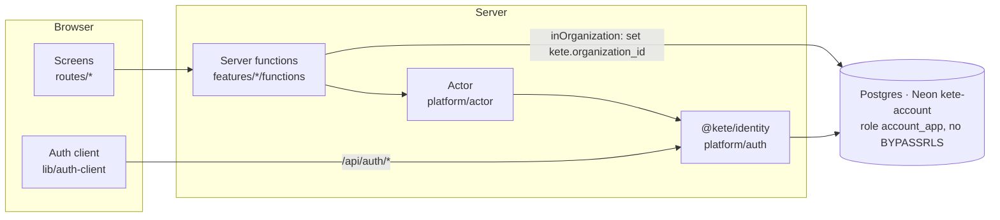
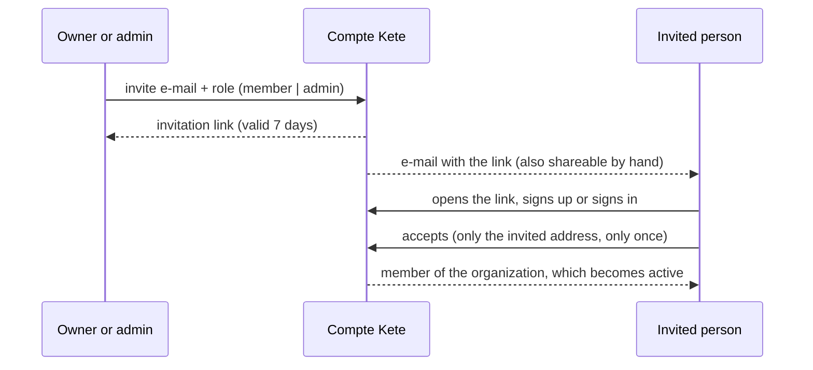

# Compte Kete (`apps/account`)

One account for every Kete app, organizations and their roles, and **Mon espace Kete**: the
client's single place for their tools, their organization and its generic settings (spec
`specs/003-compte-kete`).

## Screens

| Path                            | What it is for                                                                                   |
| ------------------------------- | ------------------------------------------------------------------------------------------------ |
| `/connexion`, `/inscription`    | Sign in, create an account (e-mail and password)                                                 |
| `/forgot-password`              | Ask for a link to choose a new password (spec 025)                                               |
| `/reset-password`               | Choose the new password from the e-mailed link; every other session is closed                    |
| `/espace`                       | My tools: the Kete apps of the active organization                                               |
| `/espace/nouvelle-organisation` | Create an organization (the creator becomes its owner)                                           |
| `/espace/abonnements`           | Subscriptions: offers, paying, access per tool                                                   |
| `/espace/organisation`          | Members, roles, invitations                                                                      |
| `/espace/parametres`            | Logo, and generic settings: identity, legal identifiers, language, time zone, currency, channels |
| `/espace/securite`              | Two-factor authentication (authenticator app, backup codes)                                      |
| `/connexion/code`               | The second step of a sign-in with two-factor                                                     |
| `/invitation/$id`               | Accept an invitation                                                                             |

Machine endpoints: `/api/auth/*` (the identity, including `/api/auth/token` and the published keys
at `/api/auth/jwks`), `/api/apps/*` (trusted Kete apps), `/api/admin/offers` (Kete Cockpit),
`/api/payments/notifications` (the payment provider's signed notifications), `/health`,
`/.well-known/kete`. Every one of them except the last two is described in OpenAPI 3.1:
`docs/generated/account.openapi.json`, generated by `pnpm openapi:generate` from the identity and
from `src/platform/openapi.ts`, whose request bodies are the schemas the routes validate with
(spec 026).

## Architecture



- **Identity** is `@kete/identity` (spec 026): Better Auth with the Kete rules, which any instance
  keeping its own identity reuses. `platform/auth.ts` gives it what is the Compte Kete's own: its
  e-mails, its `account.created` event, the offers behind the `apps` claim, its operators and its
  pages. Its tables (users, sessions, organizations, members, invitations, keys) are global by
  nature — decision `docs/decisions/0003`.
- **Organization data** (`organization_settings`, and every table after it) carries its
  organization and is protected by row-level security created in the same migration. Server code
  reaches it only through `inOrganization(organizationId, …)`, after resolving the actor's
  membership and role.
- Identifiers are prefixed: `usr_`, `org_`, `mbr_`, `inv_`, `ses_`, `jwk_`, `fil_`.
- **Files** (`features/files`, `@kete/files`): the logo is sent by the browser straight to the
  Neon object storage of the same branch, then read, re-encoded and made available by the server;
  the `files` rows are under RLS and a logo can only point at a file of its organization.
- **Payments** (`features/payments`, `@kete/payments`): a global catalog of offers (read-only for
  the service, set by operators with `pnpm --filter @kete/account offers`), checkouts and
  subscriptions under RLS. A notification is only a hint: the sale is re-read from the provider
  and applied once; the token carries `apps`, the end of access per tool (grace included).
- **One sign-in for every Kete app** (spec 007): the Compte Kete is an OAuth 2.1 / OpenID Connect
  provider. Apps are trusted clients registered by operators (`pnpm --filter @kete/account
clients`); they sign people in with `@kete/auth`. Discovery at `/.well-known/openid-configuration`.
- **Operators**: owners and admins of `KETE_OPERATORS_ORGANIZATION_ID` with two-factor on. They
  alone register apps and use `/api/admin/offers` (Kete Cockpit), whose writes go through two
  definer functions — the catalog stays read-only otherwise.
- **Events** (spec 010): `account.created` and `payment.succeeded` go to Kete Cockpit through the
  `@kete/sdk` outbox (written in the same transaction as the change) and its relay, signed with
  the key the Cockpit handed out (`KETE_EVENTS_*`). `/health` reports the backlog.
- E-mails go through `@kete/notify` (`platform/email.ts`, see E-mails below): invitations work through
  their link, shown to the person who invites, and e-mailed through @kete/notify (spec 025).
  E-mail verification and the verified-address requirement on invitations remain a separate
  decision: turning them on would lock out existing unverified accounts.

### Invitation



A member can neither invite nor change roles nor change settings: refused by the server, not only
hidden.

### E-mails (spec 025)

Sent through `@kete/notify` (`src/platform/email.ts`): MailKite when `MAILKITE_API_KEY` is set,
otherwise nothing leaves and only the subject is logged. Templates are React Email
(`src/features/emails/templates.tsx`), their words in the catalogs, in the request's language.

| Template                     | When                                                                         |
| ---------------------------- | ---------------------------------------------------------------------------- |
| `invitation`                 | An owner or admin invites someone (link valid 7 days)                        |
| `password-reset`             | A new password is asked for an account that has one (link valid 1 hour)      |
| `password-reset-unavailable` | The same, for an account without a password: it learns why, nothing is added |

Better Auth would add a password to an account that has none; a passkey-only account chose to have
none (spec 016), so it never gets a link. An unknown address gets nothing, and the screen says the
same thing in every case.

## Run locally

`apps/account/.env` (never committed; see `.env.example`) points at the `test` branch of the Neon
project `kete-account`.

```bash
pnpm --filter @kete/account dev
```

Migrations (owner role): `pnpm --filter @kete/account db:generate` after a schema change, then
`db:migrate`. A new Neon branch first runs `db/bootstrap.sql`.

Storage: each branch has a private bucket `files`. Browsers may upload only from the Compte
Kete's origins: `ACCOUNT_STORAGE_CORS_ORIGINS="https://…" pnpm --filter @kete/account storage:cors`
(with the `ACCOUNT_STORAGE_*` variables of that branch).

## Tests

- `tests/isolation.test.ts` — two organizations never read nor write each other's settings, in
  the database and in the service (SC-002).
- `tests/files.test.ts` — the logo on the real database and storage: re-encoded without metadata,
  invisible to another organization, disguised files refused and never served, decided once,
  replaced and removed, administrators only.
- `tests/payments.test.ts` — paid sales open access once and extend from the end; forged,
  replayed, unpaid or mismatching sales grant nothing; another organization sees nothing.
- `tests/admin.test.ts` — who is an operator (organization, role, second factor, still so in the
  database) and catalog writes at the provider's price.
- `e2e/sso.spec.ts` — a witness app on `@kete/auth`: sign-in when not signed in, silent sign-in
  with organization and role, an unregistered address refused, admin API 401/403.
- `tests/events.test.ts` — the organization and payment events, delivered signed and marked
  delivered.
- `e2e/account.spec.ts` — the production build in a browser: sign-up to tools, duplicate address,
  settings, invitation accepted once, logo, member refusals, token verified by `@kete/auth`, 375 px
  and English, sign-in rate limiting.

```bash
pnpm --filter @kete/account test
pnpm --filter @kete/account test:e2e
```

## Deploy

`pnpm --filter @kete/account build`, then `pnpm --filter @kete/account start` (srvx, port 3000).
Environment: `ACCOUNT_DATABASE_URL` (application role), `BETTER_AUTH_SECRET`, `BETTER_AUTH_URL`
(public origin), `ACCOUNT_STORAGE_*` (object storage of the same branch), `PAYMENTS_CHARIOW_*`, `KETE_ENVIRONMENT`, and
optionally `KETE_TOOL_*_URL` for the tools that are live.
