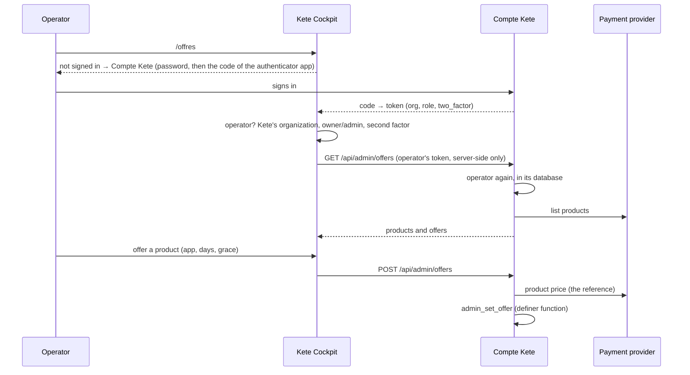

# Kete Cockpit (`apps/cockpit`)

Where Kete operators run the Kete apps (doctrine step 1, decision D-022). V0: operators sign in
with their Compte Kete and manage the **offers catalog** that clients buy from in Mon espace Kete.
The app registry, events, the morning brief and agent access come next (see the roadmap).

## Screens

| Path         | What it is for                                                    |
| ------------ | ----------------------------------------------------------------- |
| `/offres`    | Offers on sale or withdrawn; the store's products not yet offered |
| `/refus`     | Why someone cannot enter (not an operator, no second factor)      |
| `/au-revoir` | After signing out of the Cockpit                                  |
| `/auth/*`    | Sign-in with the Compte Kete (start, callback, sign-out)          |
| `/health`    | Liveness                                                          |

## How it works



- **One account**: the Cockpit has no passwords; it signs operators in with `@kete/auth`
  (`createKeteSignIn`, `keepAccessToken`). The token stays in the Cockpit's signed HttpOnly cookie
  and is only used server-side; the session ends with the token (15 min) and renews silently
  through the Compte Kete.
- **Operators**: owners or admins of `KETE_OPERATORS_ORGANIZATION_ID`, with two-factor on — checked
  by the Cockpit, and again by the Compte Kete on every admin call.
- No database of its own yet.

## Run locally

`apps/cockpit/.env` (see `.env.example`) with the Compte Kete running on port 3100 and the Cockpit
registered there (`pnpm --filter @kete/account clients create …`, redirect
`http://127.0.0.1:3300/auth/callback`).

```bash
pnpm --filter @kete/cockpit dev
```

## Tests

`e2e/cockpit.spec.ts` (production builds of both apps, Neon `test`, a fake payment provider): an
operator signs in with two-factor, offers a product that a client then sees in Mon espace Kete,
withdraws it, and a client of Kete is refused.

```bash
pnpm --filter @kete/cockpit test:e2e
```

## Deploy

`apps/cockpit/Dockerfile` (context at the repository root). Environment: `KETE_ACCOUNT_URL`,
`COCKPIT_URL`, `COCKPIT_CLIENT_ID`, `COCKPIT_CLIENT_SECRET`, `COCKPIT_SESSION_SECRET`,
`KETE_OPERATORS_ORGANIZATION_ID`.
