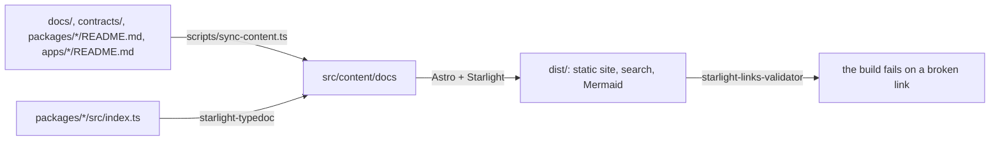

# Kete Core documentation site (`apps/docs`)

The documentation of `kete-core`, published as a static site (decisions 0006 and doctrine D-032).
It is **built from the repository itself**: nothing here duplicates what the repository says.



| Command             | What it does                                     |
| ------------------- | ------------------------------------------------ |
| `pnpm docs:dev`     | Reads the site locally while editing (port 4321) |
| `pnpm docs:build`   | Builds the site into `apps/docs/dist`            |
| `pnpm docs:preview` | Serves the built site                            |

## Where a page goes (Diátaxis)

- **How-to guides**: operations, releasing packages.
- **Reference**: packages (their READMEs), contracts (JSON Schema), apps, and each package's API
  generated from its code by TypeDoc.
- **Explanation**: architecture, roadmap, flows, decisions (MADR).

A new Markdown file appears on the site once `scripts/sync-content.ts` maps it to a route. Links
between repository files are rewritten to site routes; a link to a file that is not on the site
points to it on GitHub.

## Deploying

`apps/docs/Dockerfile` builds the site from the repository root and serves it with nginx:

```sh
docker build -f apps/docs/Dockerfile -t kete-docs .
```
