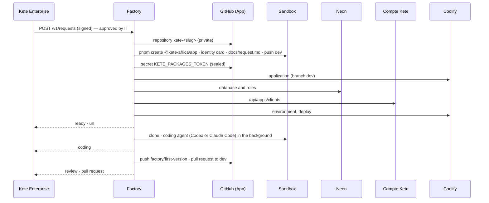

# The app factory

From an approved request to a running Kete app (spec 048): its repository from the template, its
database, its sign-in, its hosting, its first version coded by an agent in a sandbox, and a pull
request a person reviews. Only Kete Enterprise calls it, signed; it holds the powerful keys
(GitHub App, hosting, databases) so that nothing else does.

- **Each step once.** The progress of a request is kept; a job that fails runs again from the
  step it stopped at. The coding agent works in the background; the job comes back every two
  minutes until it is done.
- **No secret kept.** The app's secrets go straight to its hosting; secrets reach a sandbox in a
  file it alone reads, never in a command line; a sandbox gets none of the provider account's
  own secrets and is deleted after its step.
- **A person decides.** IT approves the request in Kete Enterprise; the first version arrives as a
  pull request to `dev`, reviewed and merged by a person; `main` stays the human gesture.

## Run

`pnpm start` with the variables of `.env.example`. Tests: `pnpm test` (every outside service is a
fake).

## The Codex agent with a ChatGPT subscription

`FACTORY_CODEX_AUTH_JSON` holds the `auth.json` that `codex login` writes. Treat it as a password.
It refreshes itself inside each sandbox; when the subscription asks to sign in again, run
`codex login` and replace it. For unattended runs, an API key is steadier.
