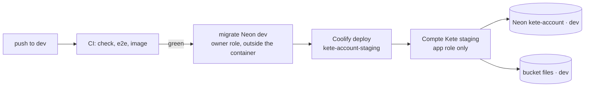

# Operations — Kete Core

Where the Kete Core services run and how they go live. No secret here: values live in Coolify, in
GitHub Actions secrets, and in the author's local `.env` (never committed).

## Compte Kete — staging

| What           | Where                                                                                                                       |
| -------------- | --------------------------------------------------------------------------------------------------------------------------- |
| Address        | <https://compte-kete-staging.13.140.178.49.sslip.io>                                                                        |
| Coolify        | project `Kete`, environment `staging`, application `kete-account-staging` (`lhu4zeod5dbf19tcjfqmhd00`), server `KYA-Server` |
| Source         | GitHub App `kete-coolify` (owned by `kete-africa`, installed on `kete-core` only), branch `dev`                             |
| Image          | `apps/account/Dockerfile`, context at the repository root                                                                   |
| Database       | Neon `kete-account`, branch `dev`, application role `account_app` (no BYPASSRLS)                                            |
| Object storage | bucket `files` of the same branch; credential `kete-account-staging` anchored on `dev`                                      |
| Health         | the image probes its own `/health` (Coolify's probe needs curl, absent from the slim image)                                 |

### Environment of the application

`ACCOUNT_DATABASE_URL` (application role), `BETTER_AUTH_SECRET` (staging's own; it encrypts the
signing keys stored on the branch — losing it means new keys and new sessions), `BETTER_AUTH_URL`
(the address above), `ACCOUNT_STORAGE_*`, `KETE_ENVIRONMENT=staging`. All runtime-only, none
available at build time.

### Deploying

1. Merge into `dev` once every check is green.
2. Migrate the `dev` branch with the **owner** role — the running container never holds it:
   `ACCOUNT_OWNER_URL=<dev owner URL> pnpm --filter @kete/account db:migrate`.
3. Deploy: `POST /api/v1/deploy` on Coolify with `{"uuid": "lhu4zeod5dbf19tcjfqmhd00"}`.
4. Check: `/health` says `healthy`, `/.well-known/kete` says `staging`, then the journeys:
   `ACCOUNT_E2E_BASE_URL=https://compte-kete-staging.13.140.178.49.sslip.io pnpm test:e2e`.

Steps 2 and 3 run from the author's machine until a **deploy-only Coolify token** exists; then CI
runs them after a green push on `dev`. The instance-wide token is never stored in GitHub.

### Payments

- **Provider**: Chariow. Store, products and the Pulse (notification endpoint) are created in the
  Chariow dashboard; its API cannot create them.
- **Pulse**: URL `https://compte-kete-staging.13.140.178.49.sslip.io/api/payments/notifications`,
  events _successful sale_, _failed sale_, _abandoned sale_. Its signing secret (`whsec_…`) goes to
  `PAYMENTS_CHARIOW_PULSE_SECRET`; the store API key to `PAYMENTS_CHARIOW_API_KEY`.
- **Offers**: `pnpm --filter @kete/account offers set --app nettio --product prd_… --days 30`
  with the branch's owner URL (`ACCOUNT_OWNER_URL`) — the price is read from the provider.
- A Pulse is disabled by Chariow after 5 failed attempts: re-enable it in the dashboard.

### Sign-in for Kete apps and operators

- `KETE_OPERATORS_ORGANIZATION_ID`: Kete's own organization in this Compte Kete. Its owners and
  admins with two-factor on are operators.
- An operator registers each app once (its secret is printed once, then kept with the app's
  secrets):
  `OPERATOR_PASSWORD=… pnpm --filter @kete/account clients create --operator … --code 123456 --name "Kete Cockpit" --redirect https://…/auth/callback`
  with the branch's `ACCOUNT_DATABASE_URL`, `BETTER_AUTH_SECRET`, `BETTER_AUTH_URL`.

### Storage CORS

Browsers upload straight to the bucket, only from the Compte Kete's origin:
`ACCOUNT_STORAGE_CORS_ORIGINS=https://compte-kete-staging.13.140.178.49.sslip.io pnpm --filter @kete/account storage:cors`
with the branch's `ACCOUNT_STORAGE_*` variables.

## Kete Cockpit — staging

Created: Coolify application `kete-cockpit-staging` (branch `dev`, `apps/cockpit/Dockerfile`),
Neon `kete-cockpit` branch `dev` migrated, `KETE_ACCOUNT_URL`, `COCKPIT_URL`,
`COCKPIT_SESSION_SECRET`, `COCKPIT_ENCRYPTION_KEY` (kept also in the local `.env`: losing it means
new keys for every app) and `COCKPIT_DATABASE_URL` (app role) set — runtime only.

To open it, the author:

1. Signs up on the staging Compte Kete, creates the organization « Kete », turns on two-factor
   (Mon espace Kete → Sécurité).
2. Runs `pnpm --filter @kete/account staging:operator` (e-mail, password and code asked on the
   terminal, never stored). It makes that organization the operators' organization on both apps,
   registers the Cockpit as a Compte Kete client, hands its secret straight to the hosting
   environment and redeploys both apps.
3. In the Cockpit, registers the staging Compte Kete (`https://compte-kete-staging…`), then gives
   the Compte Kete staging app `KETE_EVENTS_URL=https://cockpit-kete-staging…/api/events` and the
   shown `KETE_EVENTS_KID` / `KETE_EVENTS_SECRET`, and redeploys it: its events start flowing.

## Apps that provision people by phone (spec 013)

A messaging app (Firmo) is registered with `--people`: it may then provision people by the phone
number its channel proved (`POST /api/apps/people`) and ask their one-time sign-in links
(`POST /api/apps/sign-in-links`), with a `client_credentials` token carrying `kete:people`:

`pnpm --filter @kete/account clients create --operator <email> --name "Firmo" --redirect https://…/auth/callback --people`

Links are never e-mailed: the app hands them to the person in her conversation. They work once, for
ten minutes, never for a person with a second factor, and land only on the app's own origin.

## Production

Nothing follows `main` yet. The production application is created when the author decides the
first release (branch `main`, Neon `main`, its own secret, storage credential and domain).
