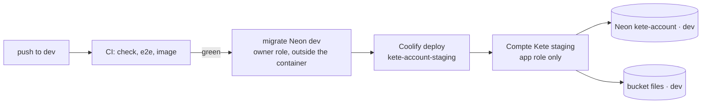

# Operations — Kete Core

Where the Kete Core services run and how they go live. No secret here: values live in Coolify, in
GitHub Actions secrets, and in the author's local `.env` (never committed).

## Compte Kete — staging

| What           | Where                                                                                                                       |
| -------------- | --------------------------------------------------------------------------------------------------------------------------- |
| Address        | <https://compte-kete-staging.13.140.178.49.sslip.io>                                                                        |
| Coolify        | project `Kete`, environment `staging`, application `kete-account-staging` (`lhu4zeod5dbf19tcjfqmhd00`), server `KYA-Server` |
| Source         | GitHub App `kete-coolify` (owned by `kete-africa`, installed on `kete-core` only), branch `dev`                             |
| Image          | `apps/account/Dockerfile`, context at the repository root                                                                   |
| Database       | Neon `kete-account`, branch `dev`, application role `account_app` (no BYPASSRLS)                                            |
| Object storage | bucket `files` of the same branch; credential `kete-account-staging` anchored on `dev`                                      |
| Health         | the image probes its own `/health` (Coolify's probe needs curl, absent from the slim image)                                 |

### Environment of the application

`ACCOUNT_DATABASE_URL` (application role), `BETTER_AUTH_SECRET` (staging's own; it encrypts the
signing keys stored on the branch — losing it means new keys and new sessions), `BETTER_AUTH_URL`
(the address above), `ACCOUNT_STORAGE_*`, `KETE_ENVIRONMENT=staging`. All runtime-only, none
available at build time.

### Deploying

1. Merge into `dev` once every check is green.
2. Migrate the `dev` branch with the **owner** role — the running container never holds it:
   `ACCOUNT_OWNER_URL=<dev owner URL> pnpm --filter @kete/account db:migrate`.
3. Deploy: `POST /api/v1/deploy` on Coolify with `{"uuid": "lhu4zeod5dbf19tcjfqmhd00"}`.
4. Check: `/health` says `healthy`, `/.well-known/kete` says `staging`, then the journeys:
   `ACCOUNT_E2E_BASE_URL=https://compte-kete-staging.13.140.178.49.sslip.io pnpm test:e2e`.

Steps 2 and 3 run from the author's machine until a **deploy-only Coolify token** exists; then CI
runs them after a green push on `dev`. The instance-wide token is never stored in GitHub.

### Storage CORS

Browsers upload straight to the bucket, only from the Compte Kete's origin:
`ACCOUNT_STORAGE_CORS_ORIGINS=https://compte-kete-staging.13.140.178.49.sslip.io pnpm --filter @kete/account storage:cors`
with the branch's `ACCOUNT_STORAGE_*` variables.

## Production

Nothing follows `main` yet. The production application is created when the author decides the
first release (branch `main`, Neon `main`, its own secret, storage credential and domain).
