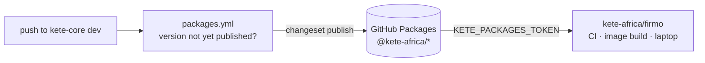

# 0005 — Shared packages are published on GitHub Packages

## Context and Problem Statement

Applies to `packages/*`, and every Kete app outside this repository (Firmo first).

A named registry makes each dependency explicit (name, version, source repository), reviewable in
the consuming app's lockfile, and upgradable like any npm package — instead of files copied between
repositories.

## Decision Outcome

The shared packages are published to **GitHub Packages**, the npm registry of the `kete-africa`
organization, under the `@kete-africa` scope: `@kete-africa/sdk`, `@kete-africa/auth`,
`@kete-africa/files`, `@kete-africa/payments`, `@kete-africa/design`.

- **Publishing** is done by this repository's CI only (`.github/workflows/packages.yml`), on a
  push to `dev`, for each package whose version is not in the registry yet — with the workflow's
  own token, never a personal one. A published version is immutable: a change ships as a new
  version (semver). Versions and changelogs come from Changesets (decision
  [0006](0006-tooling-and-documentation.md)).
- **The code keeps importing `@kete/*`.** Inside this repository the apps alias the workspace
  packages (`"@kete/sdk": "workspace:@kete-africa/sdk@*"`); an app elsewhere aliases the published
  ones (`"@kete/sdk": "npm:@kete-africa/sdk@^0.1.0"`).
- At publish time, `publishConfig.exports` points at the compiled `dist/src` (JavaScript and
  types); inside the workspace, packages are used from source.
- **Reading** needs a token with `read:packages`, the same everywhere: `KETE_PACKAGES_TOKEN`, in the
  app's CI secrets, its image build (a build secret, never an image layer) and developers' machines.

### Consequences

One personal access token (classic, `read:packages` only) created by the author, and the
`@kete-africa` registry line in each consuming app's `.npmrc`.
