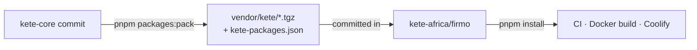

# 0005 — Shared packages travel to other repositories as vendored tarballs

- **Status**: accepted
- **Date**: 2026-09-29
- **Applies to**: `packages/*`, and every Kete app outside this repository (Firmo first)

## Decision

An app in its own repository (doctrine D-023: `kete-africa/firmo`) consumes `@kete/*` as
**tarballs committed in its repository** (`vendor/kete/`), produced here by
`pnpm packages:pack` from a clean commit. `vendor/kete/kete-packages.json` records the kete-core
commit and each tarball's version and SHA-256; the app's `package.json` points at the files
(`"@kete/sdk": "file:vendor/kete/kete-sdk-0.1.0.tgz"`) and its lockfile pins their integrity.

Inside this repository nothing changes: packages are used from source through the workspace. At
pack time, `publishConfig.exports` points at the compiled `dist/src` (JavaScript and types).

## Why not a private registry yet

A registry (GitHub Packages) needs, for one consuming app: a publishing token, a reading token on
every developer machine, a reading token in the app's CI and in its image build on Coolify, and a
manual access grant per package. Tarballs need none of that, build offline, and are reviewed in the
app's pull request like any dependency bump. "On ne construit que ce qui a déjà fait mal."

## What would reverse it

A second repository consuming the packages at a different pace, or tarballs growing beyond a few
hundred kilobytes: then publish to GitHub Packages under `@kete-africa/*`, with pnpm aliases so
imports stay `@kete/*`.
