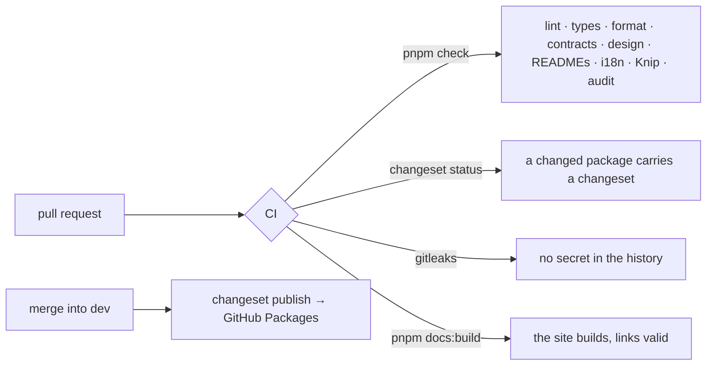

# 0006 — Releases, guards and documentation rely on recognized tools

## Context and Problem Statement

Applies to the whole repository (spec `020-tooling-and-docs`).

`kete-core` is about to receive the shared building blocks of every Kete product (doctrine D-030).
Before that, it must release, update, guard and document itself with tools that every agent and
every developer already knows, instead of scripts of its own; and the author must be able to
publish its documentation in one command (doctrine D-032).

## Decision Drivers

- A recognized tool before our own code (doctrine D-032, D-034).
- The repository stays the single source of truth: the documentation is built from it.
- No secret in a file, a message or a commit (constitution).

## Considered Options

- Keep the in-house publishing loop and write more checks of our own.
- Adopt recognized tools for each need.

## Decision Outcome

Chosen option: "Adopt recognized tools for each need".

| Need                             | Tool                                                                                                                     |
| -------------------------------- | ------------------------------------------------------------------------------------------------------------------------ |
| Versions, changelogs, publishing | **Changesets**: a changeset per package change, `pnpm release:version` on a release branch, `changeset publish` on `dev` |
| Dependency updates               | **Renovate**, weekly, grouped, on `dev`                                                                                  |
| Secrets in the history           | **gitleaks**, in its own CI job, values redacted                                                                         |
| Vulnerable dependencies          | **`pnpm audit`**, failing on high or critical advisories                                                                 |
| Unused files and dependencies    | **Knip** (unused exports later, once the shared blocks have settled)                                                     |
| Documentation site               | **Starlight** (Astro), organized by **Diátaxis**, built from the repository                                              |
| API reference                    | **TypeDoc**, through `starlight-typedoc`, from each package's entry point                                                |
| Links and diagrams               | `starlight-links-validator` (the build fails on a broken link), Mermaid                                                  |
| Technical decisions              | **MADR** 4 (`docs/decisions/template.md`)                                                                                |

### Consequences

- Good, because each need has a documented, maintained tool, and one command publishes the docs.
- Good, because the site cannot drift from the repository: it is generated from it.
- Bad, because Renovate needs its GitHub App installed on `kete-africa` by the author.
- Bad, because code scanning (CodeQL) needs GitHub Advanced Security on private repositories; it
  is left out until that changes.

### Confirmation

CI runs every step above on each pull request; `pnpm docs:build` fails on a broken link.

## More Information

The OpenAPI description of the Compte Kete API comes with `@kete/identity` (spec 026); AsyncAPI for
events comes with the event catalog of `@kete/capabilities` (spec 023).
