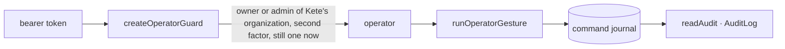

# @kete/admin

The operator space of a Kete product: **who is a Kete operator**, **operator gestures** as
journaled commands, and the **audit** of what happened.



```ts
const { requireOperator } = createOperatorGuard({
  verify: createTokenVerifier({ issuer: accountUrl }), // @kete/auth
  operatorsOrganizationId: () => process.env.KETE_OPERATORS_ORGANIZATION_ID ?? null,
  stillOperator: isOperator, // a token lives 15 minutes; the database says now
});

const identity = await requireOperator(request); // AdminError 401 / 403 otherwise
await runOperatorGesture(transaction, setOffer, { identity, idempotencyKey }, input);
```

- **Refusals say why**: `unauthenticated`, `invalid_token` (401), `not_an_operator` (403);
  `adminErrorResponse` turns them into answers.
- **Every gesture is a named command** (@kete/commands): journaled with the operator, the channel
  and whether it can be undone; a retried request with the same key is replayed, not repeated.
- **The audit** (`@kete/admin/ui`, `AuditLog`): when, who and for whom, through what, what was done.
  Every word through props. The Compte Kete's admin API uses this package.
