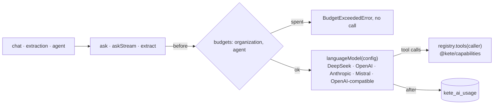

# @kete/ai

One **model port** for every Kete product: the provider is configuration, never code (doctrine
D-029), a product's **capabilities become the model's tools** (under the same rights and autonomy
rules as the screens), and every call's **usage is measured** against monthly **budgets** per
organization and per agent. Built on the Vercel AI SDK.



## Use

```ts
import {
  ask,
  askStream,
  extract,
  languageModel,
  modelConfigFromEnv,
  postgresBudgetStore,
} from '@kete/ai';

const model = languageModel(modelConfigFromEnv()); // KETE_AI_PROVIDER, KETE_AI_MODEL, KETE_AI_API_KEY
const metering = {
  store: postgresBudgetStore(pool),
  context: { organizationId, actor, purpose: 'chat', model: '' },
};

// The chat: the caller's capabilities as tools, streamed to the screen.
const stream = await askStream({
  model,
  system,
  messages,
  tools: await registry.tools(caller),
  metering,
});
return stream.toUIMessageStreamResponse();

// Reading a message, a transcript or a photo's text into a record, then a draft for a person.
const { value } = await extract({ model, schema: quote.schema, prompt: message, metering });
```

| Export                                                  | What it does                                                                       |
| ------------------------------------------------------- | ---------------------------------------------------------------------------------- |
| `languageModel`, `embeddingModel`, `transcriptionModel` | A model from a `ModelConfig` (`modelConfigFromEnv` reads it from the environment)  |
| `ask`, `askStream`                                      | A conversation turn with tools (at most `maxSteps` model steps), metered           |
| `extract`                                               | A structured value of a Zod schema, metered                                        |
| `scanReader`                                            | A scan (image, PDF without text) read page by page: `@kete/files`' transcriber     |
| `toolsFrom`                                             | Capabilities (`registry.tools(caller)`) as AI SDK tools                            |
| `postgresBudgetStore`, `aiMigrationSql`                 | Usage (append-only) and monthly token budgets in the product's Postgres, under RLS |

## Choosing the provider (doctrine D-029)

The provider is chosen by the **sensitivity of the data**, per product or per task. DeepSeek's own
API processes data in China; its open-weight models can be served elsewhere through
`openai-compatible` (a European host, or the client's own servers). Nothing in a product's code
names a provider.

## Rules

- A budget is checked **before** the call; a scope without a budget row is not limited.
- Usage is recorded in its own transaction: the tokens were spent, whatever happens next.
- The model never sees data the caller may not see: tools go through the capability registry.
