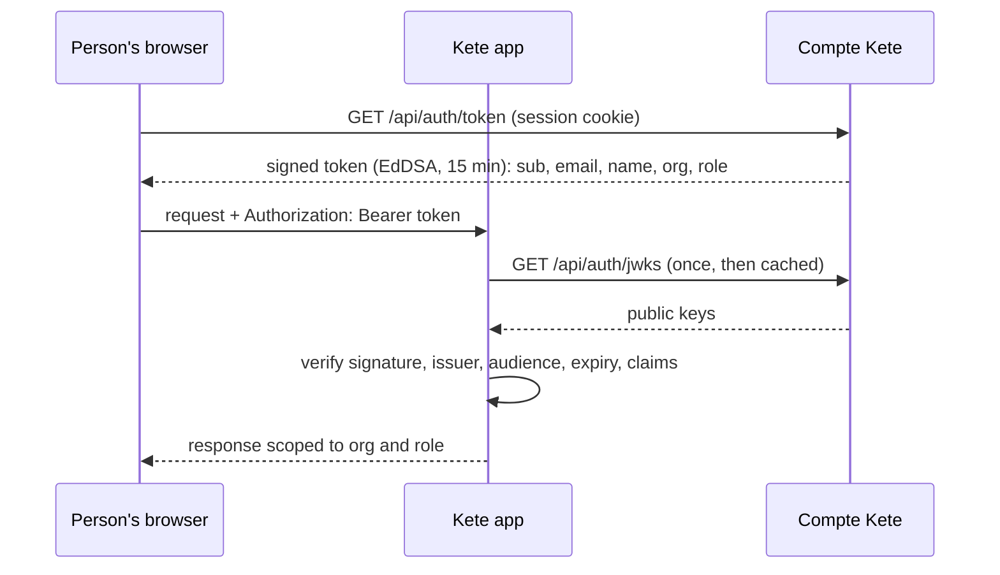

# @kete/auth

Verifies a **Compte Kete token** inside a Kete app: who the person is, their active organization
and their role — without calling the Compte Kete on every request.

## Use

```ts
import { createTokenVerifier, InvalidTokenError } from '@kete/auth';

const verify = createTokenVerifier({ issuer: 'https://compte.kete.africa' });

try {
  const identity = await verify(bearerToken);
  // identity.userId, identity.email, identity.name,
  // identity.organizationId (null without organization), identity.role ('owner' | 'admin' | 'member' | null)
} catch (error) {
  if (error instanceof InvalidTokenError) {
    // error.code: 'expired' → ask the Compte Kete for a fresh token; 'invalid' → refuse
  }
}
```

The app gets the token from the Compte Kete (`GET /api/auth/token`, with the person's session); it
lives 15 minutes.

## What is refused

Every token that is not exactly a Compte Kete token (spec 003, SC-003): altered, expired, signed by
a key that was never published (even with a known key id), unsigned (`alg: none`), from another
issuer, for another audience, or with malformed Kete claims (unknown role, role without
organization). Tests: `tests/verify.test.ts`.

## How it works



Keys rotate on the Compte Kete: a token signed by a key the app has not seen triggers one refetch
of the published keys. The private keys never leave the Compte Kete.
