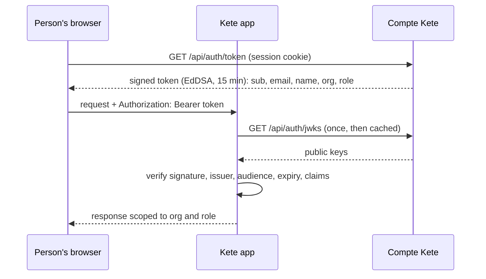

# @kete/auth

Everything a Kete app needs to sign people in with the **Compte Kete** — one account for every
Kete app — and to trust its tokens: who the person is, their active organization, their role, the
apps the organization may use, whether they use a second factor. No app keeps passwords.

## Sign people in (every Kete app)

An operator registers the app once (`apps/account/scripts/clients.ts`), which gives a client id and
secret. Then, in the app, with any framework (standard `Request` / `Response`):

```ts
import { canUse, createKeteSignIn } from '@kete/auth';

const signIn = createKeteSignIn({
  accountUrl: 'https://compte.kete.africa',
  clientId: process.env.KETE_CLIENT_ID,
  clientSecret: process.env.KETE_CLIENT_SECRET,
  redirectUri: 'https://nettio.kete.africa/auth/callback',
  sessionSecret: process.env.SESSION_SECRET, // ≥ 32 characters, this app only
});

// GET /auth/callback
export const callback = (request: Request) => signIn.callback(request);

// Any protected page or API
const identity = await signIn.session(request);
if (!identity) return signIn.start(request, { returnTo: '/tableau' });
if (!canUse(identity, 'nettio')) return subscriptionPage();
```

A person already signed in to the Compte Kete comes back without typing anything; otherwise they
sign in (with their second factor if they use one) and come back. The app's own session lasts 8
hours by default, then renews through the Compte Kete.

```mermaid
sequenceDiagram
  participant B as Browser
  participant A as Kete app
  participant C as Compte Kete
  B->>A: GET /tableau (no session)
  A-->>B: 302 to C authorize (client_id, PKCE, state, resource urn:kete:apps)
  B->>C: authorize — signs in if needed; Kete apps are trusted, no consent screen
  C-->>B: 302 to A /auth/callback?code=…
  B->>A: callback
  A->>C: POST token (code, verifier, secret)
  C-->>A: access token (JWT, 15 min): sub, org, role, apps, two_factor
  A->>A: verify with C's published keys; own session cookie
  A-->>B: 302 /tableau
```

## Verify a token (APIs, agents)

```ts
import { canUse, createTokenVerifier, InvalidTokenError } from '@kete/auth';

const verify = createTokenVerifier({ issuer: 'https://compte.kete.africa' });

try {
  const identity = await verify(bearerToken);
  // identity.userId, identity.email, identity.name,
  // identity.organizationId (null without organization), identity.role ('owner' | 'admin' | 'member' | null)
  // identity.apps: { nettio: Date, … } — end of access per tool, grace included
  if (!canUse(identity, 'nettio')) return subscriptionRequired();
} catch (error) {
  if (error instanceof InvalidTokenError) {
    // error.code: 'expired' → ask the Compte Kete for a fresh token; 'invalid' → refuse
  }
}
```

Tokens come from the sign-in above, or from the Compte Kete itself (`GET /api/auth/token`, with the
person's session); they live 15 minutes and are meant for the audience `urn:kete:apps`.

## What is refused

Every token that is not exactly a Compte Kete token (spec 003, SC-003): altered, expired, signed by
a key that was never published (even with a known key id), unsigned (`alg: none`), from another
issuer, for another audience, or with malformed Kete claims (unknown role, role without
organization). Tests: `tests/verify.test.ts`.

## How it works



Keys rotate on the Compte Kete: a token signed by a key the app has not seen triggers one refetch
of the published keys. The private keys never leave the Compte Kete.
