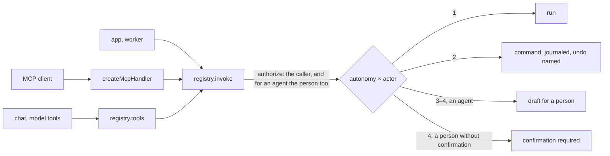
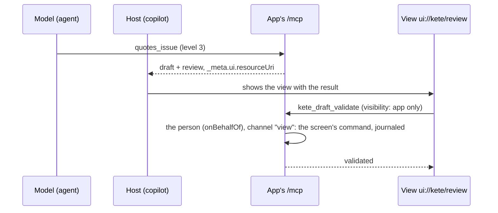

# @kete/capabilities

What a Kete product lets agents do — through **MCP** (Claude, ChatGPT, Codex), the **chat**, another
app or a worker — declared once, with its **autonomy level**, and invoked under **the same rights and
the same journal as the screens** (doctrine: the AI prepares, a person decides).

| Level | What an agent may do            | Here                                                                |
| ----- | ------------------------------- | ------------------------------------------------------------------- |
| 1     | Read, analyze, signal           | `run` executes for anyone allowed                                   |
| 2     | Act reversibly, with "Annuler"  | a **reversible** command runs; the result names its inverse         |
| 3     | Prepare a decision that commits | an agent gets a **draft** (@kete/drafts); a person runs the command |
| 4     | Irreversible, money, external   | an agent gets a draft; a person must also **confirm** explicitly    |



## Use

```ts
const issueQuote = defineCapability({
  name: 'quotes_issue', // snake_case: a valid tool name for MCP and every model provider
  description: 'Issues a quote to a client.',
  permission: 'quotes:issue',
  autonomy: 3,
  input: quoteInput, // Zod object
  command: issueQuoteCommand, // @kete/commands
  draft: { recordType: 'quote', definition: quote },
});

const registry = createCapabilityRegistry([issueQuote /* … */], {
  authorize: (caller, permission) => rights.check(caller, permission), // the host's rights
  transaction: (organizationId, work) => inOrganization(pool, organizationId, work),
});

// MCP, as a web-standard handler: mounts as is in TanStack Start or Hono.
export const mcp = createMcpHandler({ registry, server: { name: 'firmo', version }, caller });
```

- `registry.list(caller)` — the caller's capabilities, as the `capability.v1` contract describes them
  (a manifest lists them all with `registry.describeAll()`).
- `registry.tools(caller)` — the same, as tools with their Zod input and JSON Schema, for the chat
  (`@kete/ai`).
- **Rights come from the host**: an app maps them from its roles, Kete Enterprise from its
  structure. For an agent acting on behalf of a person, the host checks both.

## Permissions (spec 049)

`definePermissions` declares what an app checks, with its words in French and English and the
Compte Kete roles that hold it by default; `describePermissions` gives them to the manifest.
`createRights({ permissions, grants })` answers what a person holds: her grants at the center (Kete
Enterprise, read with `@kete/center`) once it manages the app's rights; when the center is silent,
her last grants known (24 h); otherwise her role's defaults. A capability and a data set also
declare their `classification`: `public`, `internal` (the default), `confidential` or `secret`.

```ts
const permissions = definePermissions([
  {
    name: 'tickets:manage',
    label: { fr: 'Gérer les files', en: 'Manage queues' },
    roles: ['owner', 'admin'],
  },
]);
const rights = createRights({ permissions, grants: (token) => center.grants(token) });
const held = await rights.permissionsOf({ userId, role }, token);
```

- The MCP endpoint is **stateless**: each request lists only the caller's tools. The host
  authenticates the request (OAuth access token) in `caller`.

## Views in a copilot (MCP Apps, doctrine D-037)

A capability names the **view** a copilot shows with its result — an MCP Apps resource, `ui://…`,
which the host (Kete Enterprise's copilot, Claude, ChatGPT) displays in the conversation, sandboxed.
A decision (levels 3 and 4) shows `ui://kete/review` by default: the draft, each value with its
provenance, and the person's gestures.

```ts
export const mcp = createMcpHandler({
  registry,
  server: { name: 'nettio', version },
  caller,
  views: keteViews({ design: 'kete' }), // @kete/views: review, form, table, detail
  draftUrl: (id) => `https://nettio.kete.africa/review/${id}`, // the screen, always the way back
  resourceMetadataUrl: 'https://nettio.kete.africa/.well-known/oauth-protected-resource',
});
export const resourceMetadata = protectedResourceMetadata({
  resource: 'https://nettio.kete.africa/mcp',
  authorizationServers: ['https://compte.kete.africa'],
});
```



- **The person decides, not the model.** `kete_draft_review`, `kete_draft_validate` and
  `kete_draft_refuse` are visible to the view only (`visibility: ["app"]`); hosts keep them out of
  the model's tools. They run as the person the agent acts for, through the `view` channel; the
  drafts layer refuses any actor who is not a person.
- **Level 4 is decided in the product's own screen**, with its confirmation: in the view, validating
  answers `open_in_app` with the screen's address. Refusing is possible everywhere.
- `registry.review(caller, draftId)` and `registry.decide(decision)` serve the product's screens
  too; a screen passes `confirmed: true` for level 4 after its confirmation.
- `protectedResourceMetadata` (RFC 9728) and the `WWW-Authenticate` header tell MCP clients which
  identity issues the tokens.

## Data sets and the API (spec 045)

`defineDataset` declares rows an app exposes (their schema, time field, measures, dimensions);
`createDatasetRegistry` reads them under the caller's rights; `createHttpApi` serves the
capabilities and data sets over HTTP (`/capabilities`, `/datasets`), with the same rights,
journal and autonomy as MCP and the screens. See
[spec 045](../../specs/045-integration-contract/spec.md).
