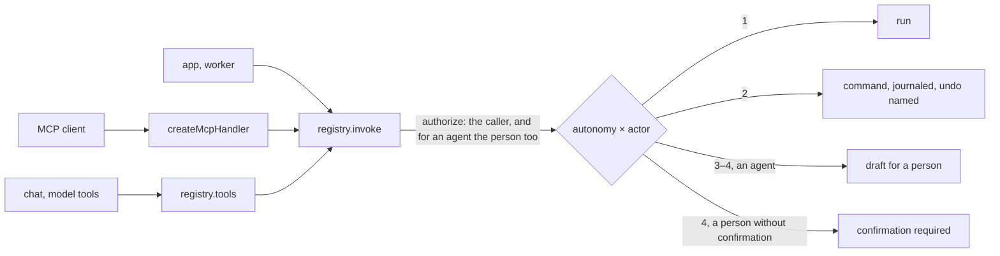

# @kete/capabilities

What a Kete product lets agents do — through **MCP** (Claude, ChatGPT, Codex), the **chat**, another
app or a worker — declared once, with its **autonomy level**, and invoked under **the same rights and
the same journal as the screens** (doctrine: the AI prepares, a person decides).

| Level | What an agent may do            | Here                                                                |
| ----- | ------------------------------- | ------------------------------------------------------------------- |
| 1     | Read, analyze, signal           | `run` executes for anyone allowed                                   |
| 2     | Act reversibly, with "Annuler"  | a **reversible** command runs; the result names its inverse         |
| 3     | Prepare a decision that commits | an agent gets a **draft** (@kete/drafts); a person runs the command |
| 4     | Irreversible, money, external   | an agent gets a draft; a person must also **confirm** explicitly    |



## Use

```ts
const issueQuote = defineCapability({
  name: 'quotes_issue', // snake_case: a valid tool name for MCP and every model provider
  description: 'Issues a quote to a client.',
  permission: 'quotes:issue',
  autonomy: 3,
  input: quoteInput, // Zod object
  command: issueQuoteCommand, // @kete/commands
  draft: { recordType: 'quote', definition: quote },
});

const registry = createCapabilityRegistry([issueQuote /* … */], {
  authorize: (caller, permission) => rights.check(caller, permission), // the host's rights
  transaction: (organizationId, work) => inOrganization(pool, organizationId, work),
});

// MCP, as a web-standard handler: mounts as is in TanStack Start or Hono.
export const mcp = createMcpHandler({ registry, server: { name: 'firmo', version }, caller });
```

- `registry.list(caller)` — the caller's capabilities, as the `capability.v1` contract describes them
  (a manifest lists them all with `registry.describeAll()`).
- `registry.tools(caller)` — the same, as tools with their Zod input and JSON Schema, for the chat
  (`@kete/ai`).
- **Rights come from the host**: an app maps them from its roles, Kete Enterprise from its
  structure. For an agent acting on behalf of a person, the host checks both.
- The MCP endpoint is **stateless**: each request lists only the caller's tools. The host
  authenticates the request (OAuth access token) in `caller`.
