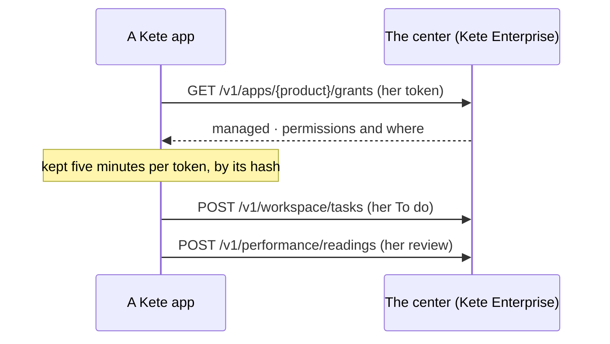

# @kete/center

What a Kete app asks its center — Kete Enterprise — with the **person's token** (kete-core spec
049): the center answers within her rights, never more. Without a center, or when it does not
answer, the app goes on alone: nothing here throws at the app.



```ts
import { createCenter } from '@kete/center';

const center = createCenter({
  url: process.env.ENTERPRISE_API_URL,
  product: 'prd_kete_helpdesk',
  source: 'kete-helpdesk',
});
const grants = await center.grants(token); // null: no center, no token, or no answer
await center.sendTask(token, { key: 'TKT-42', title: 'Rétablir le service', href });
```

## The directory

`center.me(token)` gives the person's positions, units, managers (interim included) and reports;
`center.person(token, userId)` a colleague, `center.unit(token, unitId)` a unit — null whatever she
may not see (Kete Enterprise spec 023).

## Decisions

`center.requestDecision(token, { subject, reference, title, measure })` asks the organization's
circuits, for the person; once decided, the center posts the request's id to the app's
`callbackUrl`, and the app reads the outcome with its own token: `center.decision(appToken,
organizationId, requestId)` (Kete Enterprise spec 023).

## Business events

`center.eventsUrl` is where the app delivers its business events, with its own token
(`createAppToken` of `@kete/auth`, scope `kete:center`) through a named outbox of `@kete/sdk`.

- **Grants** feed `createRights` of `@kete/capabilities`: until the organization manages the app's
  rights at the center (`managed: false`), the app keeps its defaults.
- **Never a secret in a cache key**: grants are kept per token's SHA-256, five minutes at most.
