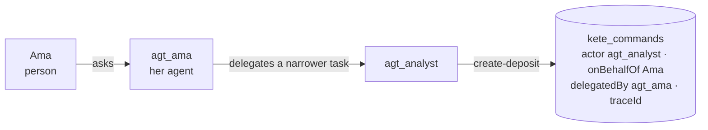

# @kete/commands

Every gesture of a Kete service is a **named command**, never a generic update (CONCEPTION 7):
`create-deposit`, `mark-ready`, `cancel-deposit`. Each carries its **actor** — who, on behalf of
whom, through which channel (CONCEPTION 10) — an **idempotency key**, and declares whether it can be
**undone**, and by which command. That declaration sets how far an agent may act alone.

```mermaid
sequenceDiagram
    participant S as Surface (web · API · MCP · chat · worker)
    participant C as executeCommand
    participant DB as Postgres (organization set, RLS)
    S->>C: command, actor, idempotency key, input
    C->>C: validate actor and input (Zod)
    C->>DB: lock the key; already done?
    alt same key, same input
        DB-->>S: the stored result (replayed, nothing runs again)
    else new key
        C->>DB: handler (the change)
        C->>DB: append the journal entry
        DB-->>S: result
    end
```

## Use

```ts
import { defineCommand, executeCommand } from '@kete/commands';
import { inOrganizationTx, sqlExecutorOf } from '@kete/tenancy/drizzle';

const createDeposit = defineCommand({
  name: 'create-deposit',
  input: depositInput, // Zod
  reversibility: { reversible: true, inverse: 'cancel-deposit' },
  handler: async (input, { db, organizationId, actor }) => {
    /* the change, in the caller's transaction */
  },
  summarize: (input) => `Dépôt de ${input.items} articles`,
});

await inOrganizationTx(db, organizationId, (tx) =>
  executeCommand(sqlExecutorOf(tx), createDeposit, {
    organizationId,
    actor: { kind: 'agent', id: 'agt_sales', channel: 'mcp', onBehalfOf: { kind: 'person', id } },
    idempotencyKey: request.headers.get('idempotency-key'),
    input,
  }),
);
```

## Guarantees

- **One run per key.** The same key and input replay the stored result; the same key with another
  input is refused (`idempotency_conflict`). A concurrent retry waits for the first, then replays.
- **Nothing half done.** A failing handler rolls back to a savepoint: no change, no journal entry,
  and the key stays free.
- **Append-only journal, enforced by the database.** `commandsMigrationSql` creates `kete_commands`
  with its RLS policy; the application role may insert and read it, never update or delete it.
- **Its own organization only.** A command refuses a transaction set for another organization.
- `readJournal(db, { name, traceId, limit })` gives the active organization's latest commands.

## A chain of agents (doctrine D-039)

An agent may work for another agent. The gesture then carries its chain: `delegatedBy` lists the
agents that asked, from the first (the one the person asked) to the last, and `traceId` ties
together every gesture of the delegated task. The actor is refused (`invalid_actor`) unless:

- the actor is an agent, acting `onBehalfOf` a **person**: a chain always goes back to a human;
- every agent appears once, and at most `MAX_DELEGATION_DEPTH` (4) agents asked.



```ts
actor: {
  kind: 'agent',
  id: 'agt_analyst',
  channel: 'mcp',
  onBehalfOf: { kind: 'person', id: 'usr_ama' },
  delegatedBy: [{ kind: 'agent', id: 'agt_ama' }],
  traceId: 'trc_pipeline-review',
}
```

The chain only records who asked: narrowing the rights at each step is the job of whoever issues
the agents' tokens (`kete-enterprise`), and a draft is still decided by a person, never by an
agent. Apps created before this add `commandsDelegationMigrationSql` to their migrations
(additive, idempotent).

| Actor kinds                         | Channels                                                                                 |
| ----------------------------------- | ---------------------------------------------------------------------------------------- |
| `person`, `agent`, `service`, `app` | `web`, `api`, `mcp`, `view`, `chat`, `whatsapp`, `telegram`, `email`, `worker`, `script` |
