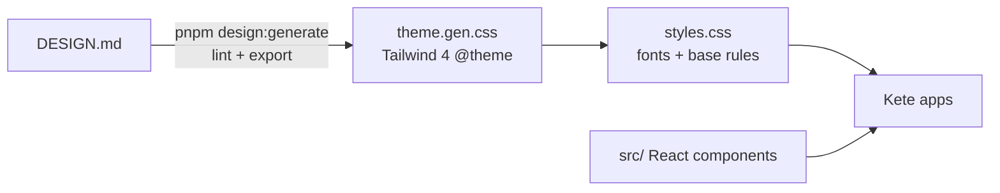

# @kete/design

The Kete design system, **v1 rectangle**: warm rigor — living roots inside a rectangular structure.

## Source of truth: `DESIGN.md`

[`DESIGN.md`](DESIGN.md) follows the [DESIGN.md format](https://github.com/google-labs-code/design.md):
machine-readable tokens (colors, typography, radii, spacing, components) followed by the rationale
agents and people read before designing a screen. It is linted by the official linter with **no
error and no warning**, and the Tailwind 4 theme (`theme.gen.css`) is generated from it.



`pnpm design:check` (part of `pnpm check`, run in CI) fails if `DESIGN.md` has a lint warning or if
`theme.gen.css` no longer matches it. Never edit `theme.gen.css` by hand.

## Use in an app (Tailwind 4)

```css
@import 'tailwindcss';
@import '@kete/design/styles.css';
@source '../node_modules/@kete/design/src';
```

```tsx
import { Button, KeteBand, KeteMark, Panel, Tag, TextField } from '@kete/design';

<KeteBand />
<Panel title="Produits">
  <Tag tone="verify">À vérifier</Tag>
  <TextField label="Montant" uncertain hint="Tiré du message WhatsApp · à vérifier" />
  <Button>Valider le devis</Button>
</Panel>
```

Every visible string comes from the app's translation catalogs; the examples above are literal only
for illustration.

## Rules that matter most

- Laterite is the brand and stays rare; **errors are wine**, with a square marker and a word.
- **Never** a negative amount or a debt in the brand red.
- Rectangles: radius 0 for surfaces, 2 px for controls; 1 px rules; no shadows.
- Numbers in JetBrains Mono, tabular, aligned right.
- Fonts are self-hosted (Archivo, Instrument Sans, JetBrains Mono): no third-party font request.
