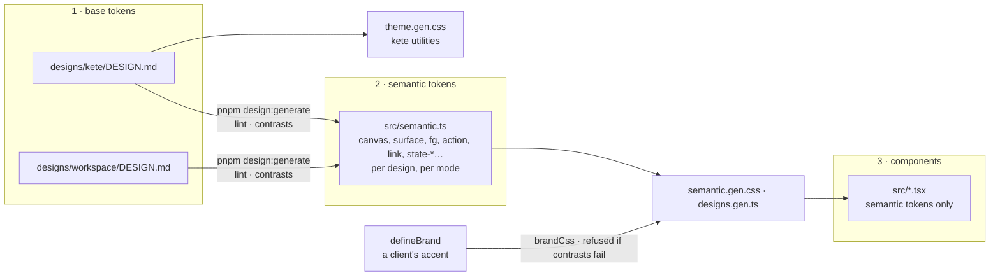
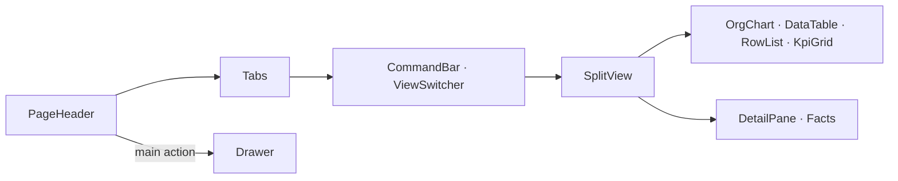

# @kete/design

Two designs, in three layers, and the brand of each client (doctrine D-035):

- **`kete`** — v1 rectangle, warm rigor: the Kete site, the Compte Kete, Mon espace Kete and the
  Kete Apps. [`designs/kete/DESIGN.md`](designs/kete/DESIGN.md).
- **`workspace`** — Kete Enterprise: the system of the `copilot-demo` workspace the author chose,
  reproduced value for value — dark first (#282828, #242424, lines #494949, text #DEDEDE), a 262 px
  sidebar, 34 px items, 5 px corners, 24 px pills, Segoe UI at 14 px, the client's green to guide
  and its orange for the focus. [`designs/workspace/DESIGN.md`](designs/workspace/DESIGN.md).

## Three layers



1. **Base tokens**: each design's `DESIGN.md`, in the
   [DESIGN.md format](https://github.com/google-labs-code/design.md), linted with **no error and no
   warning** (the linter also checks the contrasts of the components it declares), exported as W3C
   Design Tokens (`tokens.gen.json`). The `kete` design's are also the Tailwind utilities its apps
   use (`theme.gen.css`: `bg-sand`, `text-ink`…).
2. **Semantic tokens**: what a color is _for_ — surfaces (`canvas`, `surface`, `surface-raised`,
   `surface-hover`, `surface-selected`, `surface-control`), text (`fg`, `fg-soft`, `fg-muted`),
   lines (`line`, `line-strong`, `line-control`, `line-selected`, `line-overlay`), `accent`,
   `action`, `action-strong`, `on-action`, `link`, `focus`, `agent`, `notice`, and
   `state-{success,verify,error,info}` with `-fg` and `-surface` — plus the fonts (`font-ui`,
   `font-heading`), the corners (`rounded-control`, `-box`, `-pill`, `-menu`, `-overlay`), the
   control height and padding, the icon-button size and the focus offset. `src/semantic.ts` maps
   them onto each design's base tokens, for the light and the dark mode, gives each design its
   default mode, and lists the **contrast pairs** every design meets (WCAG 2.2: 4.5:1 for text, 3:1
   for the accent and the focus).
3. **Components** use semantic tokens only — a test fails on any base color — so the same code
   wears both designs, both modes and a client's brand.

`pnpm design:check` (part of `pnpm check`, in CI) fails on a lint warning, a missed contrast, or a
generated file out of date. Never edit a `*.gen.*` file by hand.

## Page slots and chat (spec 040)

An enterprise page is made of fixed slots, so that whatever is added opens an interface of the
same shape in the same places: `PageHeader` (breadcrumb, title, status, one main action), `Tabs`
(an object's facets), `CommandBar` with `ViewSwitcher` (the view's formats, in the address),
`SplitView` (the content beside its `DetailPane` and `Facts`), and the contents `DataTable`,
`RowList`, `KpiGrid`/`KpiTile` and `OrgChart`. A short form opens in a `Drawer`. The chat kit —
`ChatThread`, `ChatMessage`, `ToolCard`, `Markdown`, `Suggestions`, `Composer`, `CopyButton` —
meets what people expect from an assistant. See [spec 040](../../specs/040-page-slots/spec.md).



## Use in an app (Tailwind 4)

```css
@import 'tailwindcss';
@import '@kete/design/styles.css';
@source '../node_modules/@kete/design/src';
```

The page chooses its design and mode on `<html>`:

```html
<html data-design="workspace" data-theme="auto" data-brand="atelier-bleu"></html>
```

`data-design`: `kete` (default) or `workspace`. `data-theme`: `light` or `dark` (or `night`), or
`auto` (the device's); without it, each design's default mode — light for `kete`, dark for
`workspace`. `data-brand`: a client's brand, on `workspace`.

`examples/design-preview` shows both designs and a brand, in both modes, one page at a time.

## Components

| Component                                           | For                                                                                     |
| --------------------------------------------------- | --------------------------------------------------------------------------------------- |
| `Button`, `IconButton`, `TextField`, `Tag`, `Panel` | Controls; a field filled by an agent and uncertain says where it comes from             |
| `Dialog`                                            | A modal dialog with its named close button; Escape and a click outside close it         |
| `VerificationCard`                                  | A draft prepared by the agent, each field with its provenance, and the decision's trace |
| `AgentState`                                        | Prepared (empty square), corrected, verified, refused (filled: a person decided)        |
| `ConfirmDialog`                                     | The confirmation of an irreversible gesture (autonomy level 4)                          |
| `UndoNotice`                                        | What an agent did reversibly, with « Annuler » (level 2)                                |
| `EmptyState`                                        | An empty page: what will be here, the gesture that fills it                             |
| `Shell`, `NavSection`, `NavItem`, `Icon`            | The workspace frame: collapsible sidebar, toolbar, line icons                           |
| `PageTitle`, `PageSection`, `AppGrid`, `AppCard`    | The page: its title, sections, the company's apps (featured, row, list)                 |
| `Chip`, `ChipGroup`, `Menu`, `SearchField`          | Filters by category, menus, the search field                                            |
| `Swatches`                                          | The client's colors, at the bottom of the sidebar                                       |
| `KeteMark`, `KeteBand`                              | The marks of the `kete` design, in Kete's own palette                                   |

Every visible string comes from the app's translation catalogs, through props.

## A client's brand

```ts
import { brandCss, defineBrand } from '@kete/design';

const brand = defineBrand({
  id: 'atelier-bleu',
  name: 'Atelier Bleu',
  logo: { light: '/brand/logo.svg' },
  accent: '#3B82F6', // guides: hover lines, the search field, notifications
  action: '#1D4ED8', // the primary button
  palette: [{ value: '#3B82F6', name: 'Bleu' }],
});
// <style>{brandCss(brand)}</style> and <html data-design="workspace" data-brand="atelier-bleu">
```

Its colors replace the workspace's accent and primary action (and its focus, if given) in both
modes; the text on the action is chosen to read. A palette that misses a contrast against the
workspace's surfaces is **refused** (`BrandContrastError`, with each failing pair and its ratio) —
the client gives a darker action, or other colors for light mode (`light`).

## Rules that matter most

- In `kete`, laterite is the brand and stays rare; in `workspace`, the accent guides and nothing
  else of a client's brand appears but its logo and its charter.
- In `workspace`, white text never sits on the light green (3.2:1): the primary button uses the
  darker green, #177969.
- **Errors are wine**, with a square marker and a word — never the accent.
- Numbers in JetBrains Mono, tabular, aligned right.
- Fonts are self-hosted and free (Archivo, Instrument Sans, Inter, JetBrains Mono). `workspace`
  names Segoe UI first, used where the system provides it, and is never shipped (its file is
  licensed); elsewhere, Inter.
- `workspace` reproduces the demo's system, never another product's name, logo or app icons.
