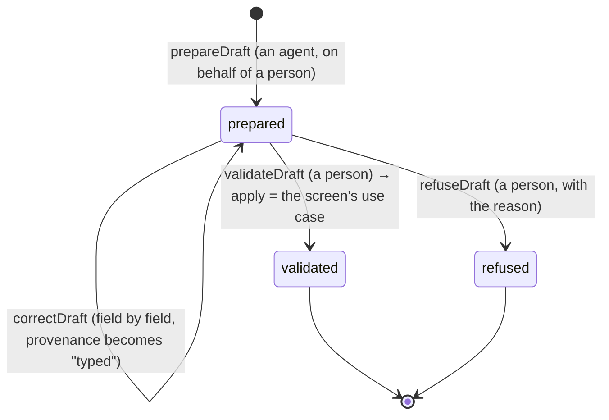

# @kete/drafts

**The AI prepares, a person decides** (doctrine). An agent — through MCP, WhatsApp, a photo, a voice
note — prepares a **draft**: a record not created yet, or a **change proposed** to an existing one.
It has no effect until a person validates it; each field says **where it came from**; the decision
is **traced**; what the person corrected becomes **learning material** (CONCEPTION A.2, A.3, 10).



## Use

```ts
const draft = await prepareDraft(tx, {
  organizationId,
  actor: { kind: 'agent', id: 'agt_firmo', channel: 'whatsapp', onBehalfOf: kofi },
  recordType: 'quote',
  definition: quote, // @kete/records: values checked against the schema (a draft may be incomplete)
  values: { client: 'Ama', total: { amount: 50000, currency: 'XOF' } },
  provenance: { client: { source: 'voice', by: agent, certainty: 'medium', evidence: fileId } },
});

// The verification link opens the draft; the person corrects, then validates:
await validateDraft(tx, {
  draftId: draft.draftId,
  actor: kofi, // a person, or `human_required`
  definition: quote, // now a complete record
  apply: (values) => executeCommand(tx, createQuote, {/* the same use case as the screen */}),
});
```

## Guarantees

- **No effect before validation.** A draft lives in `kete_drafts`, never in the record's table.
- **Only a person decides.** `validateDraft` and `refuseDraft` refuse an agent, a service or an app.
- **The same use case as the screen.** Validation runs `apply` in the same transaction; if it fails,
  the draft stays waiting.
- **Frozen once decided, by the database.** A restrictive RLS policy lets the application role
  update only drafts still waiting; a validated or refused draft cannot be changed.
- **Provenance per field**: `typed`, `system`, `message`, `photo`, `voice`, `document`, `inferred`,
  `import`, with who, how sure, and the evidence.
- **Corrections kept**: field by field, what was prepared and what was validated.
- `draftsMigrationSql` creates the table with its policies (constitution V).
