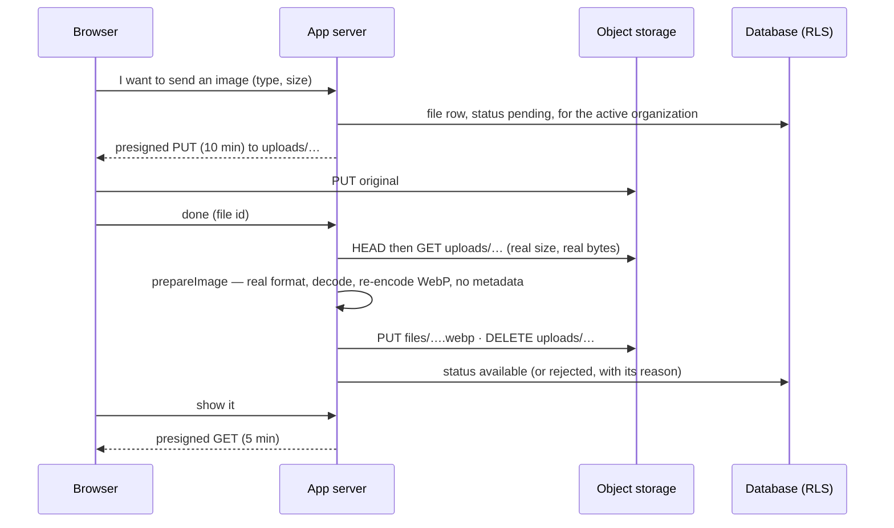

# @kete/files

Files for Kete apps: a **storage port** with an S3-compatible adapter (Neon object storage first,
decision 0002), **presigned transfers** so browsers send and read content directly, and
**images made safe** before anyone can see them (decision 0001).

## Use

```ts
import { prepareImage, s3Storage, UnsafeFileError } from '@kete/files';

const storage = s3Storage({ endpoint, region, bucket, accessKeyId, secretAccessKey });

// 1. The browser gets a short-lived address and sends the original there.
const upload = await storage.presignUpload(`organizations/${org}/uploads/${id}`, {
  contentType: 'image/png',
});

// 2. The server reads it, keeps it only if it is a real image, re-encodes it, stores the result.
try {
  const safe = await prepareImage(original, { maxBytes: 5 * 1024 * 1024, maxDimension: 1024 });
  await storage.put(`organizations/${org}/files/${id}.webp`, safe.body, safe.contentType);
} catch (error) {
  if (error instanceof UnsafeFileError) {
    // error.code: 'too_large' | 'unsupported_type' | 'unreadable'
  }
}

// 3. Reading always goes through a short-lived address.
const url = await storage.presignDownload(`organizations/${org}/files/${id}.webp`);
```

`memoryStorage()` implements the same port for tests.

## The flow



## Rules

- **Content is judged by its bytes, never by its name or declared type.** A presigned PUT does not
  bind the content type on Neon object storage: an SVG sent as `image/png` arrives. The server
  refuses it after reading it.
- **Only JPEG, PNG and WebP**, re-encoded as WebP: re-encoding drops anything hidden in the
  original; location, camera and comment metadata are removed; the camera's orientation is
  applied first. SVG, GIF, PDF and everything else are refused until a scanner exists for them.
- **Size and pixels are bounded** before decoding (decompression bombs).
- **Keys** are ASCII paths without `..`; one organization's files live under its own prefix, but
  isolation is enforced by the database rows that point at them, not by the prefix.
- **No permanent public URL**; buckets stay private.

## What Neon object storage does and does not do (measured)

| Capability                                      | Result                                 |
| ----------------------------------------------- | -------------------------------------- |
| Put, get, head, delete                          | Works                                  |
| Presigned PUT and GET                           | Works                                  |
| Content type bound by a presigned PUT           | **Not enforced** — checked server-side |
| `response-content-disposition` on presigned GET | **Ignored** — not offered by the port  |
| Bucket CORS (browser uploads)                   | Works (`apps/account` `storage:cors`)  |
| Unsigned request                                | Refused                                |

## Tests

- `tests/images.test.ts` — re-encoding, metadata removal, orientation, resizing, refusals.
- `tests/storage.test.ts` — the same contract on `memoryStorage()` and on Neon object storage
  (branch `test` of `kete-account`), presigned transfers included.

## Documents: read, filled from templates, turned into PDF (spec 053)

```mermaid
flowchart LR
  F[a file] --> R[readDocument · unpdf, officeparser] --> T[text page by page]
  S[a scan · image, PDF without text] --> TR[transcribe · the caller's model] --> T
  W[a company's Word template · {client} {#lines}] --> FT[fillTemplate · docxtemplater] --> D[a final .docx]
  D & M[Markdown · HTML] --> P{PdfConverter}
  P -->|KETE_GOTENBERG_URL| G[gotenbergConverter · LibreOffice, Chromium]
  P -->|none| X[no PDF: the .docx or .md stays]
```

- `readDocument(contentType, bytes, { transcribe? })` reads PDF (unpdf); Word, Excel, PowerPoint,
  OpenDocument and RTF (officeparser); text, CSV, Markdown, JSON. A PDF's pages, a workbook's sheets
  and a presentation's slides are its pages, so that a citation names its page. A scan — an image,
  or a PDF whose pages hold almost no text — is read by the `transcribe` port when the caller gives
  one (a multimodal model, through `@kete/ai`); without it an image stays an image.
  `readable(contentType)` says whether it is read.
- `templateFields(template)` lists what a template asks for; `fillTemplate(template, values)` fills
  it — a missing value stays empty, never « undefined ». The company keeps its layout and logo.
- `gotenbergConverter({ url })` turns a Word document, HTML or Markdown into PDF through Gotenberg;
  `pdfConverterFromEnv()` reads `KETE_GOTENBERG_URL`, null without it.
