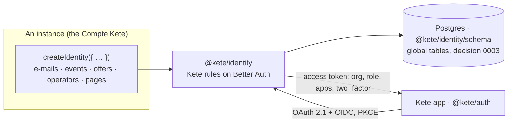

# @kete/identity

The Compte Kete's rules on **Better Auth**, for every instance that keeps its own identity (doctrine
D-026): the Compte Kete itself, and an autonomous Kete Enterprise instance. People with a password,
passkeys or both, a second factor, organizations with an owner, admins and members, invitations,
one-time sign-in links for people provisioned by phone, and the **OpenID provider** every Kete app
signs in with (`@kete/auth` is the other side). No server framework: the instance brings its
framework's cookie plugin.



## Use

```ts
import { createIdentity, prefixedIds } from '@kete/identity';
import * as identitySchema from '@kete/identity/schema';

export const { auth, claimsOf, signInMethods, signsInStrongly, removePassword } = createIdentity({
  appName: 'Kete',
  baseURL: 'https://compte.kete.africa',
  secret: process.env.BETTER_AUTH_SECRET,
  db, // Drizzle over Postgres, through the application role (no BYPASSRLS)
  schema: { ...identitySchema, ...ownTables },
  generateId: prefixedIds({ offer: 'ofr' }),
  passkeyName: 'Compte Kete',
  pages: {
    signIn: '/connexion',
    consent: '/consentement',
    home: '/espace',
    invitation: (id) => `/invitation/${id}`,
  },
  emails: { passwordReset, passwordResetUnavailable, invitation }, // through @kete/notify
  appsOf: accessUntil, // the `apps` claim
  isOperator, // who may register Kete apps
  onOrganizationCreated, // announce it
  signInLinks: { expiresIn: 600, deliver },
  scopes: ['kete:people'],
  plugins: [tanstackStartCookies()], // the framework's, last
});
```

## The rules it keeps

| Rule                                                                                             | Spec     |
| ------------------------------------------------------------------------------------------------ | -------- |
| Passwords of 10 characters or more; a reset link lasts one hour and closes every other session   | 003, 025 |
| Only an account **with** a password gets a reset link; the others are told why, nothing is added | 025      |
| A passkey-only account never removes its last passkey                                            | 016      |
| A new session opens on the person's first organization                                           | 007      |
| The creator of an organization is its owner; an invitation lasts seven days                      | 003      |
| Sign-in links: never e-mailed, single attempt, stored hashed, never for a sign-up                | 013      |
| Tokens: 15 minutes, audience `urn:kete:apps`, claims `org`, `role`, `apps`, `two_factor`         | 007, 016 |
| Registered clients only, PKCE, no dynamic registration; operators manage the clients             | 007      |
| MCP clients identify by their metadata document (CIMD), fetched safely; each person consents     | 060      |

`two_factor` is true for a person who always signs in strongly: a second factor, or passkeys only.

**MCP clients (spec 060).** Claude, ChatGPT or Codex identify by the HTTPS address of a document
describing them (Client ID Metadata Documents, the MCP 2026-07-28 way) through Better Auth's
`cimd` plugin: the document is fetched once per hour at most, through a transport that resolves the
host once, refuses private addresses and redirects, and checked by the MCP profile (name, redirect
addresses). Such a client is kept with its provenance — it can never take over a client an operator
registered — has no `client_credentials`, and each person signs in and consents to it.
`clientMetadataDocuments: { allow }` limits the hosts; `false` turns it off.

## Schema and migrations

`@kete/identity/schema` holds the Drizzle tables (Better Auth and its plugins). An instance adds
them to its own schema and generates its migrations with drizzle-kit, as the Compte Kete does
(`apps/account/drizzle.config.ts`). They are global by nature, reachable only by the instance's
application role (decision 0003).

## OpenAPI

`identityOpenApi({ baseURL })` returns the OpenAPI 3.1 description of every endpoint the identity
serves, without a database. The Compte Kete's description adds its own API to it:
`docs/generated/account.openapi.json` (`pnpm openapi:generate`, checked by `pnpm check`), rendered
on the documentation site.
