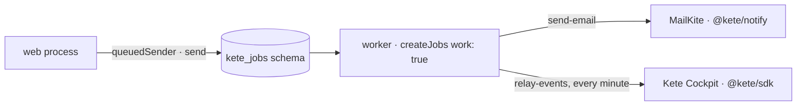

# @kete/jobs

Background jobs on the app's own Postgres (**pg-boss**): no other server to run. One image, two
roles (doctrine ARCHITECTURE_APP §9): the web process **sends** jobs, the worker **works** them —
with retries, further and further apart, and schedules.



```ts
const jobs = createJobs({
  connectionString: process.env.OWNER_DATABASE_URL, // owns the kete_jobs schema, never the app's tables
  jobs: [sendEmailJob(emailSenderFromEnv()), relayEventsJob(flushEvents)],
  work: isWorker,
});
await jobs.start();

// The web process: e-mails leave through the queue, a request never waits for the provider.
const mailer = createMailer({ sender: queuedSender(jobs), from });
```

| Export           | What it does                                                                  |
| ---------------- | ----------------------------------------------------------------------------- |
| `defineJob`      | A job: its name (kebab-case), retries, an optional cron schedule, its work    |
| `createJobs`     | Creates the queues, works them (worker) or only sends (web)                   |
| `sendEmailJob`   | Sends a queued e-mail; a provider's refusal is final, an outage is retried 5× |
| `queuedSender`   | An `EmailSender` that queues: for the web process                             |
| `relayEventsJob` | Delivers the event outbox every minute                                        |

A job's work goes through the app's own pool, under row-level security: the jobs' role never
touches the app's tables.
