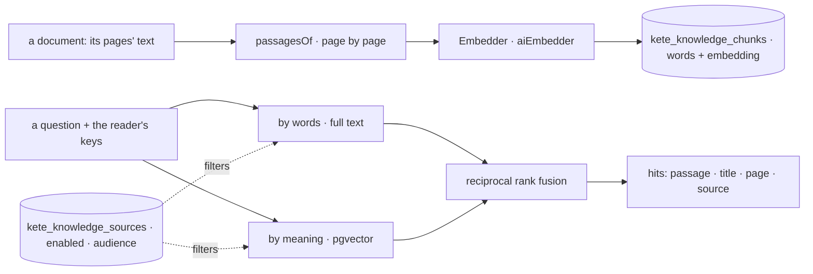

# @kete/knowledge

**An organization's knowledge, with its sources** (spec 052): its documents indexed in Postgres,
searched by words and by meaning, shown only to whoever may read each source, every answer with
what its citation needs (title, page, source). Built on what exists: the recursive splitter of
LangChain, pgvector, Postgres full-text search, and the AI SDK's embeddings through
`embeddingModel` of `@kete/ai`.



## Use

```ts
import { embeddingModel } from '@kete/ai';
import {
  aiEmbedder,
  createSource,
  indexDocument,
  knowledgeMigrationSql,
  search,
} from '@kete/knowledge';

// In a migration, with its row-level security:
knowledgeMigrationSql({ schema, appRole, dimensions: 1536 });

const embedder = aiEmbedder(embeddingModel(config), { dimensions: 1536, onUsage: meter });
const source = await createSource(tx, organizationId, {
  name: 'Procédures qualité',
  audience: ['everyone'],
});
await indexDocument(
  tx,
  { organizationId, sourceId: source.sourceId, title: 'Procédure NC v3', pages },
  embedder,
);
const hits = await search(
  tx,
  { query: 'non-conformité client', audience: ['everyone', 'unit:sav'] },
  embedder,
);
```

- **Audiences** are keys the product chooses (`everyone`, `role:admin`, `unit:sav`, `user:usr_x`).
  A reader passes her own keys; she reads a source when they meet. A source switched off is read by
  nobody, and its documents stay indexed until it comes back.
- **Pages**: a document is given as its pages' text, so that each passage cites its page.
- **Unchanged content** indexed again costs nothing; a new version replaces the old passages.
- **pgvector** lives in the `public` schema (`create extension if not exists vector`); the tables
  name its type and operator fully, whatever their own schema.
- **Later**: Docling as another extractor for scanned and complex documents, and connectors
  (SharePoint, Drive) as other kinds of sources, behind the same functions.
