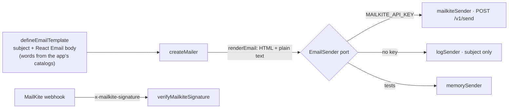

# @kete/notify

How a Kete product speaks to people: **e-mails** rendered with **React Email** and sent through a
**port** (MailKite first, doctrine D-031), **verified provider webhooks**, and the **port of chat
channels** (WhatsApp, Telegram) the apps provide adapters for. No vendor name in business code
(doctrine D-014).



## Use

```ts
const invitation = defineEmailTemplate<{ organization: string; link: string }>({
  name: 'invitation',
  render: (values, locale) => ({
    subject: m.email_invitation_subject(values, { locale }),
    body: <Invitation {...values} locale={locale} />, // React Email components
  }),
});

const mailer = createMailer({ sender: emailSenderFromEnv(), from: 'Kete <compte@kete.africa>' });
await mailer.send(invitation, { to, values, locale: 'fr' });
```

| Export                         | What it does                                                                           |
| ------------------------------ | -------------------------------------------------------------------------------------- |
| `mailkiteSender`               | `POST /v1/send` with a domain-restricted key; says whether a failure may be retried    |
| `emailSenderFromEnv`           | MailKite with `MAILKITE_API_KEY`, otherwise `logSender` (nothing leaves)               |
| `logSender`, `memorySender`    | Development without a provider (logs the subject only, never the recipient); tests     |
| `renderEmail`                  | A React Email body to HTML and plain text                                              |
| `verifyMailkiteSignature`      | HMAC-SHA256 of `t.rawBody`, constant-time, within 5 minutes                            |
| `checkEmail`, `isEmailAddress` | Refuse a message without a valid sender, recipient or subject before any provider call |
| `ChatChannel`                  | The port of WhatsApp and Telegram: `sendText` with buttons, `sendDocument`             |

## Rules

- A service uses a key **restricted to its sending domain**, from its environment; the account key
  administers MailKite only.
- An e-mail's metadata carries facts (the template's name), never personal data.
- A secret link (sign-in, new password) never reaches a log: without a provider, only the subject
  is logged.
