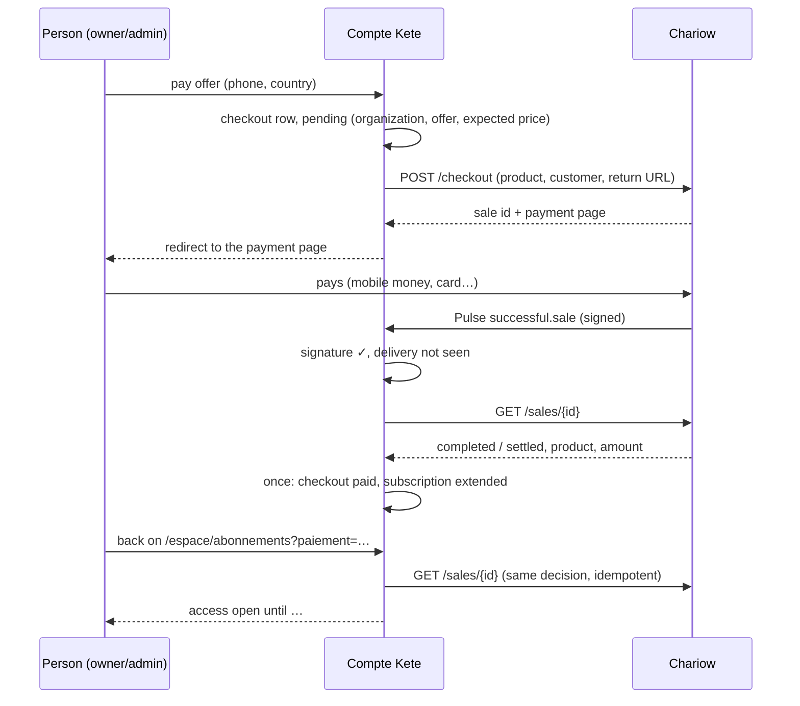

# @kete/payments

Payments for Kete: a **payment port**, the **Chariow** adapter first (doctrine: Chariow first,
behind a port), and a **fake provider** that signs its notifications like the real one, for tests.

## The rule

**A notification is a hint, never a proof.** Access is granted only after the sale is re-read from
the provider (`getSale`) and matches what was agreed: the expected product, amount and currency,
paid. A notification must also be genuine (signature) and is handled once (delivery id).

## Use

```ts
import { chariowProvider, isPaid, sameMoney } from '@kete/payments';

const provider = chariowProvider({ apiKey, pulseSecret });

// 1. A payment page for one product; the sale id is known before the customer pays.
const { saleId, checkoutUrl } = await provider.startCheckout({
  productId,
  customer,
  returnUrl,
  metadata: { kete_checkout: id },
});

// 2. A notification arrives: authenticate it from the raw body.
const notification = await provider.verifyNotification(rawBody, request.headers); // or null

// 3. Decide from the provider's truth only.
const sale = await provider.getSale(saleId);
if (isPaid(sale) && sale.productId === productId && sameMoney(sale.amount, expected)) grant();
```

## The flow in the Compte Kete



## Chariow, as measured

| Fact                                                           | Consequence                                            |
| -------------------------------------------------------------- | ------------------------------------------------------ |
| No store, product or Pulse creation by API                     | Created once in the dashboard; offers live in Kete     |
| No recurring billing, no test mode                             | A paid period (license product), repurchased to extend |
| A paid sale ends `settled` after the payout                    | `completed` and `settled` both read as paid            |
| Sale amount in the store currency; the customer may pay in XOF | Compare to the product price, in its currency          |
| `custom_metadata` absent from the sale detail                  | The organization comes from Kete's checkout row        |
| Pulses: HMAC-SHA256 of the raw body, `x-pulse-delivery-id`     | Verified in constant time; idempotency key             |
| 5 attempts, then the Pulse is disabled                         | Errors return 5xx only when a retry can help           |

## Tests

`tests/chariow.test.ts`: request and response shapes seen on the real API, statuses, prices,
signatures (forged, altered, unsigned, anonymous). With `CHARIOW_API_KEY` set (never in CI), a
read-only check runs against the real API.
