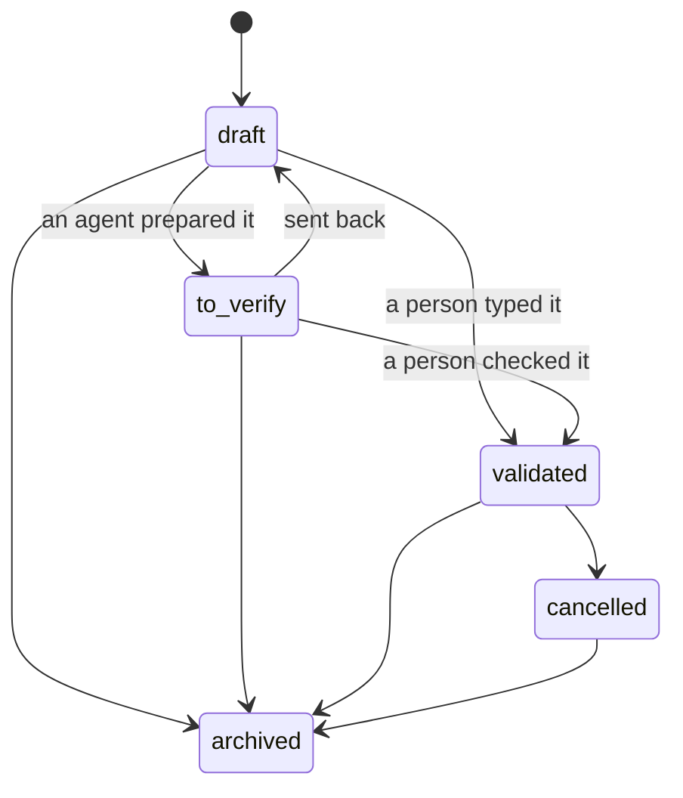

# @kete/records

A record is described **once** (CONCEPTION A.1): one Zod schema, from which come the form, the
server validation, the MCP tool's input, the API and the drafts. Each field says what it is: its
translated label, whether it is personal data, and whether a person must check it when an agent
filled it.

```ts
import { defineRecord, field, moneySchema } from '@kete/records';

export const deposit = defineRecord({
  type: 'deposit',
  prefix: 'dep',
  schema: z.object({
    customerName: field(z.string().min(1), { label: 'deposit.customer_name', personal: true }),
    items: field(z.number().int().positive(), { label: 'deposit.items', verify: true }),
    total: field(moneySchema, { label: 'deposit.total' }),
  }),
  summarize: (d) => `Dépôt de ${d.items} articles pour ${d.customerName}`,
});

deposit.fields; // name, required, label, personal, verify — for forms and verification cards
deposit.jsonSchema(); // for MCP tools, OpenAPI and other languages
```

## What else it gives

| Export                                                  | Rule                                                                                                    |
| ------------------------------------------------------- | ------------------------------------------------------------------------------------------------------- |
| `recordStates`, `canTransition`, `assertTransition`     | The lifecycle of every record that commits: draft → to verify → validated → cancelled or archived (A.2) |
| `isEffective(state)`                                    | Only a validated record counts: no total, notification or statistic before (A.2)                        |
| `redactPersonal(schema, value)`                         | Personal fields replaced by a marker, for logs, analytics and exports (A.6)                             |
| `newId('dep')`, `prefixOf`, `isId`                      | Stable, time-ordered identifiers readable by an AI: `dep_0199…` (CONCEPTION 11)                         |
| `moneySchema`, `formatMoney`, `addMoney`, `minorDigits` | Integers of the smallest unit with their currency; the CFA franc has no cents (A.5)                     |


