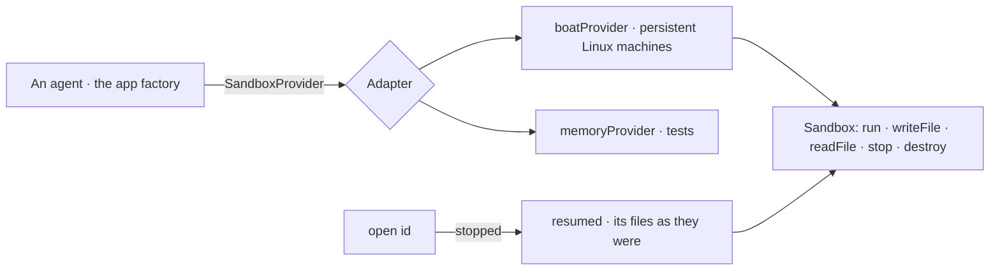

# @kete/sandbox

An isolated computer for an agent or a factory step (spec 047): create it, run commands, write and
read files, stop it, delete it. Agents run code, browse or build there — never on Kete's own
servers. One adapter per provider; the provider's name never leaves its adapter.

- `create({ ttlSeconds, env, size, idempotencyKey })`: a machine **without** the account's own
  secrets; it gets only the variables the caller gives it, and stops by itself after `ttlSeconds`.
- `open(id)`: a sandbox created earlier, ready to use — **resumed first when it was stopped**, its
  files as they were (a person's own agent sign-in among them); null when it no longer exists.
  `open(id, { resume: false })` hands it out as it is, to delete it without waking it.
- `mustRun` throws when a step fails or times out.
- **The provider's own agent**: `sandbox.prompt({ agent: 'codex', model, prompt })` starts it in
  the background, `sandbox.promptStatus(runId)` follows it — when the provider runs agents signed
  in once by the account's owner (a ChatGPT subscription). `create({ template })` names the
  provider's template that passes that sign-in and **nothing else** of the account; without a
  template, the sandbox gets nothing of the account at all.
- `memoryProvider` keeps files in memory and answers commands from a script: nothing runs.
