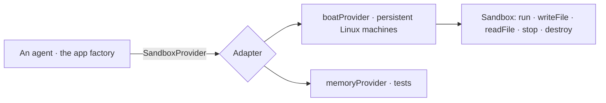

# @kete/sandbox

An isolated computer for an agent or a factory step (spec 047): create it, run commands, write and
read files, stop it, delete it. Agents run code, browse or build there — never on Kete's own
servers. One adapter per provider; the provider's name never leaves its adapter.

- `create({ ttlSeconds, env, size, idempotencyKey })`: a machine **without** the account's own
  secrets; it gets only the variables the caller gives it, and stops by itself after `ttlSeconds`.
- `mustRun` throws when a step fails or times out.
- `memoryProvider` keeps files in memory and answers commands from a script: nothing runs.
