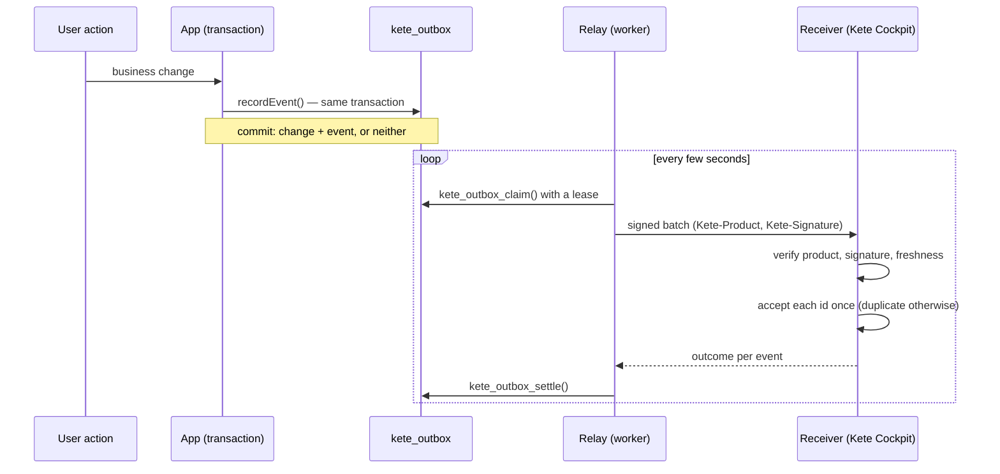
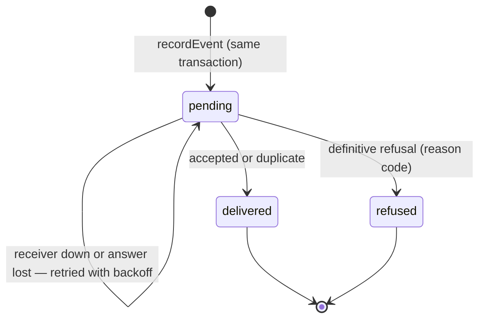

# @kete/sdk

What every Kete app uses to be observable: it **describes itself** (manifest), **reports its
health**, and **announces what happened** through signed integration events that are never lost,
never duplicated, and never block a user.

Contracts: [`/contracts`](../../contracts/README.md). Specification:
[`specs/001-contracts-and-sdk`](../../specs/001-contracts-and-sdk/spec.md).

## How an event travels



## An event's life in the outbox



## Adopting the SDK in an app

### 1. Declare the app — `kete.json`

```json
{
  "product": "prd_nettio",
  "name": "Nettio",
  "version": "1.4.0",
  "environment": "production",
  "events": ["account.created", "payment.succeeded", "metrics.daily"]
}
```

Only the event types listed here can be emitted.

### 2. Create the outbox — in a migration run by the owner role

```ts
import { outboxMigrationSql } from '@kete/sdk';

const sql = outboxMigrationSql({ appRole: 'nettio_app', ownerRole: 'nettio_owner' });
```

The table is created with its RLS policy. The application role never needs `BYPASSRLS`: the relay
claims and settles events through `SECURITY DEFINER` functions.

### 3. Record events with the business change

```ts
import { createEmitter, loadManifest, setOrganization } from '@kete/sdk';

const kete = createEmitter(loadManifest('kete.json'));

await db.transaction(async (tx) => {
  await setOrganization(tx, organizationId); // every RLS policy reads it
  await payments.markPaid(tx, invoiceId); // the business change
  await kete.record(tx, {
    type: 'payment.succeeded',
    organization: organizationId,
    data: { amount: 5000, currency: 'XOF', reference: 'chw_123' },
  });
});
```

`tx` is anything with `query(text, params)`: a `pg` client works as is. Amounts are integers in
the currency's smallest unit (XOF has none). Events carry facts and counters only — never names,
e-mails or phone numbers.

### 4. Run the relay in the worker

```ts
import { createOutboxRelay, httpTransport } from '@kete/sdk';

const relay = createOutboxRelay({
  pool, // connected with the application role
  product: 'prd_nettio',
  key: { kid: process.env.KETE_KEY_ID!, secret: process.env.KETE_KEY_SECRET! },
  transport: httpTransport({ url: process.env.KETE_RECEIVER_URL! }),
});
relay.start(5000, (error) => logger.warn(error));
```

### 5. Serve the manifest and the health report

```ts
import { healthHandler, manifestHandler, outboxBacklog } from '@kete/sdk';

export const getManifest = manifestHandler(manifest); // GET /.well-known/kete
export const getHealth = healthHandler({
  version: manifest.version,
  dependencies: [{ name: 'database', probe: () => pool.query('select 1') }],
  backlog: () => outboxBacklog(pool),
}); // GET /health — 200 healthy or degraded, 503 down
```

## Receiving events (Kete Cockpit)

```ts
import { deliveryHandler, postgresDedupeStore } from '@kete/sdk';

export const postEvents = deliveryHandler({
  keyRing: new Map([['prd_nettio', [{ kid: 'key_2026_09', secret }]]]),
  store: postgresDedupeStore(pool),
});
```

Refusal reason codes: `invalid_signature`, `stale`, `unknown_product` (whole batch, HTTP 401 —
the relay retries, the backlog shows it), `batch_too_large` (413), and per event
`invalid_payload`, `undeclared_type` (definitive).

## Guarantees and their proofs

| Guarantee                                                                                 | Proof                    |
| ----------------------------------------------------------------------------------------- | ------------------------ |
| An event commits with its change, or not at all                                           | `tests/outbox.test.ts`   |
| Organizations never see each other's events (RLS)                                         | `tests/outbox.test.ts`   |
| Two relays never deliver the same event twice                                             | `tests/outbox.test.ts`   |
| 1,000 changes with outages, lost acknowledgements and relay crashes: 0 lost, 0 duplicated | `tests/chaos.test.ts`    |
| Altered, wrong-key, unknown and stale deliveries refused; key rotation                    | `tests/receiver.test.ts` |
| Manifest and health follow their contracts                                                | `tests/handlers.test.ts` |

Integration tests run on a real Postgres: set `KETE_TEST_OWNER_URL` and `KETE_TEST_APP_URL`
(see `.env.example`).
