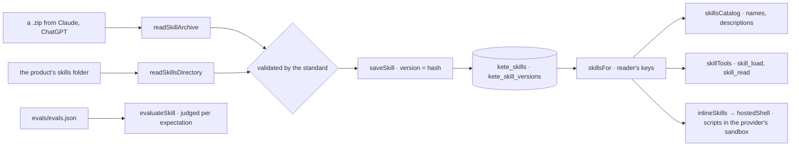

# @kete/skills

**An organization's know-how, as Agent Skills** (spec 054): folders whose `SKILL.md` says what a
skill does, when to use it and how, read and validated by the standard (agentskills.io, through its
reference library `skills-ref`), kept in Postgres with every version, opened to whom the product
says, offered to a model progressively, and checked against their own test cases. A skill made in
Claude or ChatGPT works here; one kept here goes back there as the same .zip.



## Use

```ts
import { hostedShell, languageModel, modelConfigFromEnv } from '@kete/ai';
import {
  inlineSkills,
  readSkillArchive,
  saveSkill,
  skillsCatalog,
  skillsFor,
  skillTools,
} from '@kete/skills';

// Kept: a skill uploaded as a .zip, opened to its author first.
const [skill] = readSkillArchive(uploaded);
await saveSkill(db, { organizationId, skill, by: userId, audience: [`user:${userId}`] });

// Used: what the reader may use, read progressively by the model.
const skills = [...productSkills, ...(await skillsFor(db, readerKeys))];
const config = modelConfigFromEnv();
const shell = hostedShell(config, { skills: inlineSkills(skills) });
await streamText({
  model: languageModel(config),
  system: `${system}\n\n${skillsCatalog(skills)}`,
  tools: { ...skillTools(skills), ...(shell ?? {}) },
  messages,
});
```

| Export                                                                          | What it does                                                                   |
| ------------------------------------------------------------------------------- | ------------------------------------------------------------------------------ |
| `parseSkill`, `readSkillArchive`, `readSkillsDirectory`, `skillFromText`        | A skill read and validated by the standard; `SkillError` lists the problems    |
| `skillArchive`, `skillVersion`, `skillText`, `hasScripts`                       | Its .zip, its version (hash of its files), a text file, whether it has scripts |
| `skillsMigrationSql`, `saveSkill`, `updateSkill`, `removeSkill`                 | Kept in Postgres under RLS: versions, audience, on/off, a version brought back |
| `listSkills`, `getStoredSkill`, `readStoredSkill`, `skillVersions`, `skillsFor` | Read back; `skillsFor` gives a reader the enabled skills her keys open         |
| `skillsCatalog`, `skillTools`                                                   | Progressive reading by any model: names first, `skill_load`, `skill_read`      |
| `inlineSkills`                                                                  | Skills with scripts, for `@kete/ai`'s `hostedShell` (provider's sandbox)       |
| `skillCases`, `evaluateSkill`                                                   | Its `evals/evals.json`, asked and judged per expectation, metered              |

## Rules

- **The standard decides** what a skill is: name, description, known fields, folder = name.
- **Scripts never run in the product's process**: only in the provider's sandbox, network off
  unless domains are allowed.
- **Every version is kept**; the same content is the same version, kept once.
- **No vendor name** here: the provider is configuration (`@kete/ai`).

## Tests

- `tests/skills.test.ts` — validation by the standard, .zip both ways, versions, a product's folder,
  progressive tools, the sandbox's settings, evaluation with a judge, Postgres store and isolation
  between organizations.
