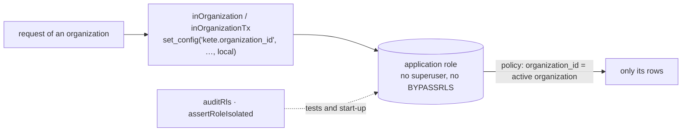

# @kete/tenancy

The organization is the hard boundary of every Kete service (constitution V): each table of
organization data carries its organization and is isolated by row-level security (RLS), and the
service connects with a role that cannot bypass it. This package is that rule, written once.



## What it gives

| Export                                            | What it does                                                                                |
| ------------------------------------------------- | ------------------------------------------------------------------------------------------- |
| `inOrganization(pool, organizationId, fn)`        | A transaction where every policy sees only that organization; the setting resets at its end |
| `organizationPolicySql({ table, appRole })`       | The SQL isolating a table, to write in the migration that creates it                        |
| `auditRls(db, { exempt })`                        | Lists every table holding `organization_id` without RLS or without a policy                 |
| `assertRoleIsolated(db)` / `checkRoleIsolation`   | Throws `RlsBypassError` if the connected role is a superuser or has `BYPASSRLS`             |
| `setOrganization(db, organizationId)`             | The setting alone, inside a transaction you manage (re-exported from `@kete/sdk`)           |
| `ORGANIZATION_SETTING`, `ACTIVE_ORGANIZATION_SQL` | The setting's name, and its SQL expression for hand-written policies                        |

### With Drizzle — `@kete/tenancy/drizzle`

```ts
import { inOrganizationTx, organizationIsolation } from '@kete/tenancy/drizzle';

const appRole = pgRole('account_app').existing();
export const files = pgTable(
  'files',
  { organizationId: text('organization_id').notNull() /* … */ },
  () => [organizationIsolation('files_isolation', appRole)],
).enableRLS();

await inOrganizationTx(db, organizationId, (tx) => tx.select().from(files));
```

The policy reads exactly like a hand-written one, so existing migrations see no change.

## Rules

- A table of organization data is created **with** its policy, in the same migration.
- Identity or catalog tables that are global by decision are listed in `exempt`, with the decision.
- Every service has a test running `auditRls` on its migrated database, and `assertRoleIsolated` on
  its application connection.
- Crossing organizations (a relay, a scheduled job) goes through `SECURITY DEFINER` functions,
  never through a role that bypasses RLS.
