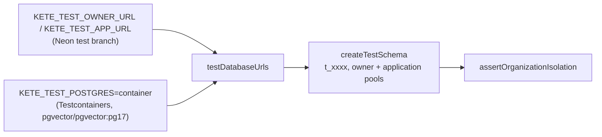

# @kete/testing

The testing kit of Kete services: a **real Postgres**, **one isolated schema per test file**, and
the **proof that two organizations never see each other**. Mocks of the database prove nothing
about row-level security; this kit tests against the real thing.



## Where the database comes from

- **By default**: the Neon `test` branch named by `<PREFIX>_TEST_OWNER_URL` and
  `<PREFIX>_TEST_APP_URL` (prefix `KETE` by default; the Compte Kete uses `ACCOUNT`).
- **`KETE_TEST_POSTGRES=container`**: a plain Postgres in a container, started once per test
  process, with an application role created like a service's (login, no superuser, no
  `BYPASSRLS`). CI runs the packages' tests this way too, so the code is proven on any Postgres,
  not only on Neon (doctrine D-029). It needs Docker.

## What it gives

| Export                                                               | What it does                                                                                   |
| -------------------------------------------------------------------- | ---------------------------------------------------------------------------------------------- |
| `createTestSchema({ migrate })`                                      | A fresh schema, the application role's grants, your migration run as the owner; `drop()` after |
| `assertOrganizationIsolation({ app, table, organizations, insert })` | Proves each organization sees only its rows, sees nothing unscoped, and cannot write another's |
| `testDatabaseUrls(prefix)`                                           | The owner and application URLs, from the environment or a container                            |
| `startPostgres()`                                                    | A container Postgres, explicitly                                                               |
| `loadRepositoryEnv()`                                                | Loads the nearest `.env` for local runs (CI sets the variables)                                |

```ts
const db = await createTestSchema({
  migrate: (owner, { schema, appRole }) =>
    owner.query(`create table notes (id serial primary key, organization_id text not null);
      ${organizationPolicySql({ schema, table: 'notes', appRole })}`),
});
await assertOrganizationIsolation({
  app: db.app,
  table: 'notes',
  organizations: ['org_a', 'org_b'],
  insert: (client, org) => client.query('insert into notes (organization_id) values ($1)', [org]),
});
```

This package depends on no other Kete package, so every package can use it in its tests.
