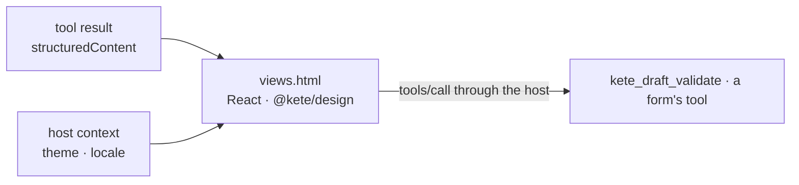

# @kete/views

Kete's **generic views for copilots** (MCP Apps, doctrine D-037): what a Kete App shows in
Kete Enterprise's copilot, Claude or ChatGPT without writing interface code. One self-contained
page (scripts and styles inlined, no request to any origin), in the product's design, following the
host's theme and language.

| View               | Shows                                                                        | From                      |
| ------------------ | ---------------------------------------------------------------------------- | ------------------------- |
| `ui://kete/review` | A draft: each value with its provenance; correct, validate (level 3), refuse | every decision capability |
| `ui://kete/form`   | A form drawn from a JSON Schema, which calls a tool with its values          | `formView({ … })`         |
| `ui://kete/table`  | A table, numbers on the right                                                | `tableView({ … })`        |
| `ui://kete/detail` | One record, field by field                                                   | `detailView({ … })`       |

```ts
import { createMcpHandler, defineCapability } from '@kete/capabilities';
import { keteViews, tableView, VIEWS } from '@kete/views';

const unpaid = defineCapability({
  name: 'invoices_unpaid',
  description: 'The unpaid invoices.',
  permission: 'invoices:read',
  autonomy: 1,
  input: z.object({}),
  view: VIEWS.table,
  run: async (_input, { db }) =>
    tableView({ title: m.unpaid_title(), columns: [/* … */], rows: await unpaidInvoices(db) }),
});

createMcpHandler({ registry, server, caller, views: keteViews({ design: 'kete' }) });
```



- **Words**: the view's own words are in `messages/` (French, English), chosen by the host's
  language; a product's words (titles, columns, field titles) come with its result.
- **A product's own view** (a map, an editor) is its own MCP Apps page, declared the same way in
  `createMcpHandler({ views })`.
- **Build**: `pnpm --filter @kete-africa/views build` writes `dist/views.html` (the tests build it).
  Fonts are not embedded: `workspace` uses the system's Segoe UI, `kete` falls back to the system's.
