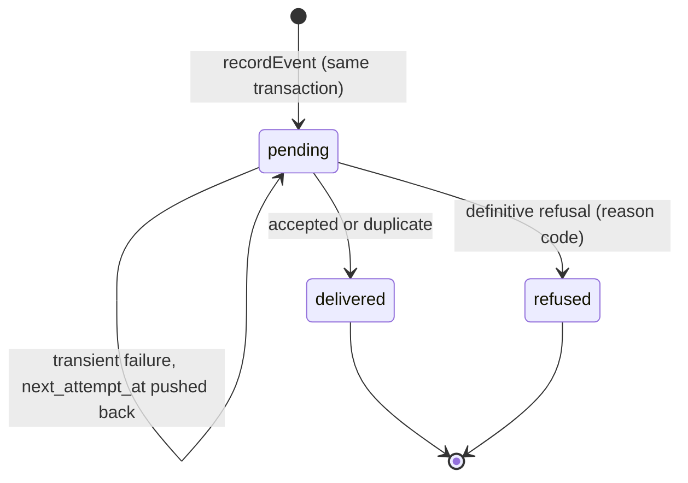

# Data Model — 001 Contracts and SDK

## Entities

### Integration event (contract `event.v1`)

| Field | Type | Rules |
|---|---|---|
| `id` | string | `evt_` + UUIDv7; unique; set by the SDK |
| `type` | string | dotted name, e.g. `payment.succeeded`; must be declared in the app manifest |
| `specversion` | string | `"1"` |
| `product` | string | the emitting app's product id, e.g. `prd_nettio` |
| `organization` | string | opaque organization reference; never a name, e-mail or phone |
| `occurred_at` | string | RFC 3339 timestamp, UTC |
| `data` | object | facts and counters only; validated per event type; no free-form personal fields |

Standard types (FR-005) and their `data`:

| Type | `data` |
|---|---|
| `account.created` | `{ plan?: string }` |
| `account.activated` | `{ activation: string }` (the app's activation milestone) |
| `payment.succeeded` | `{ amount: integer, currency: string, reference: string }` |
| `payment.failed` | `{ amount: integer, currency: string, reason_code: string }` |
| `subscription.renewal_due` | `{ due_on: date, plan: string }` |
| `account.closed` | `{ reason_code?: string }` |
| `metrics.daily` | `{ day: date, counters: { [name: string]: integer } }` |

Amounts are integers in the currency's smallest unit (XOF has none).

### Outbox entry (table `kete_outbox`, one per app database)

| Column | Type | Rules |
|---|---|---|
| `event_id` | text PK | the event `id` |
| `organization_id` | text | RLS boundary |
| `envelope` | jsonb | the full event, validated before insert |
| `status` | enum | `pending` · `delivered` · `refused` |
| `attempts` | integer | starts at 0 |
| `next_attempt_at` | timestamptz | backoff schedule |
| `leased_until` | timestamptz | set by a claim; expired leases are reclaimable |
| `last_error` | text | last transient error or refusal reason code |
| `created_at` / `settled_at` | timestamptz | |

State transitions:

RLS: the application role may insert and read its active organization's rows only. Claiming and
settling across organizations go through `SECURITY DEFINER` functions (research R-03).

### Delivery (contract `delivery.v1`)

- **Request**: `{ events: Event[] }` (1–100 events, ≤ 256 KB), with headers `Kete-Product` and
  `Kete-Signature`.
- **Response**: `{ results: [{ id, outcome: "accepted" | "duplicate" | "refused", reason? }] }`.

Refusal reason codes (FR-013): `invalid_signature`, `stale`, `unknown_product`,
`invalid_payload`, `undeclared_type`, `batch_too_large`.

### Signing key

| Field | Rules |
|---|---|
| `kid` | key id, e.g. `key_2026_09` |
| `secret` | at least 32 random bytes; never stored in the repository |
| `not_before` / `not_after` | validity window; two keys overlap during rotation |

### Manifest (contract `manifest.v1`, file `kete.json`)

| Field | Rules |
|---|---|
| `product` | product id |
| `name` | display name |
| `version` | the deployed version (semver) |
| `environment` | `production` · `staging` · `preview` · `development` |
| `events` | list of event types the app emits |
| `links` | optional: repository, documentation |

### Health report (contract `health.v1`)

| Field | Rules |
|---|---|
| `status` | `healthy` · `degraded` · `down` |
| `version` | the deployed version |
| `checked_at` | timestamp |
| `dependencies` | `[{ name, status, latency_ms? }]` — no connection strings, no secrets |
| `outbox` | `{ pending: integer, oldest_pending_age_seconds: integer? }` |

### Receiver dedupe record (receiver side)

| Column | Rules |
|---|---|
| `event_id` | unique |
| `product` | |
| `received_at` | |
