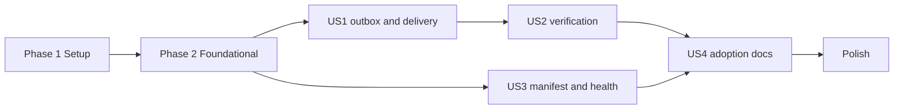

# Tasks: Contracts and SDK

**Input**: Design documents from `/specs/001-contracts-and-sdk/`

**Prerequisites**: plan.md, spec.md, research.md, data-model.md, contracts/, quickstart.md

**Tests**: required — the spec's success criteria are proofs (SC-001…SC-006) and the constitution
requires RLS isolation tests.

**Organization**: tasks are grouped by user story; each story is independently testable.

## Format: `[ID] [P?] [Story] Description`

- **[P]**: can run in parallel (different files, no dependency)
- **[Story]**: US1…US4 from spec.md

---

## Phase 1: Setup (closes roadmap phase 0)

**Purpose**: a workspace an agent can work in safely.

- [ ] T001 Create the pnpm workspace: `package.json` (Node 22 engines, scripts `check`, `test`, `contracts:generate`, `chaos`), `pnpm-workspace.yaml` (`packages/*`, `examples/*`, `tooling/*`), `.nvmrc`
- [ ] T002 [P] Add shared strict TypeScript configuration in `tooling/tsconfig/base.json` and root `tsconfig.json` with project references
- [ ] T003 [P] Add ESLint flat config with typescript-eslint and boundary rules in `tooling/eslint/index.js` and root `eslint.config.js`; add Prettier config `.prettierrc`
- [ ] T004 [P] Add Vitest workspace configuration `vitest.workspace.ts`
- [ ] T005 Add CI workflow `.github/workflows/ci.yml`: install, lint, type-check, boundaries, tests (Postgres service), generated-files check, on pull requests to `dev` and `main`
- [ ] T006 [P] Add `docker-compose.test.yml` (Postgres 17) and `tooling/scripts/bootstrap-roles.sql` (owner role, application role without `BYPASSRLS`); document `KETE_TEST_OWNER_URL` and `KETE_TEST_DATABASE_URL` in `.env.example`

**Checkpoint**: CI runs on the pull request — roadmap phase 0 proof.

---

## Phase 2: Foundational (blocking prerequisites)

**Purpose**: contracts and their generated code, shared by every story.

- [ ] T007 Move the four contracts from `specs/001-contracts-and-sdk/contracts/` to `contracts/` (event, delivery, manifest, health), with `contracts/README.md` stating the versioning rules (additive within a major version, breaking only in a new major, previous major accepted during a transition) — FR-003
- [ ] T008 Create the package skeleton `packages/sdk/` (`package.json` as `@kete/sdk`, `tsconfig.json`, `src/index.ts`)
- [ ] T009 Write `tooling/scripts/contracts-generate.ts`: generate types into `packages/sdk/src/contracts/types.gen.ts` and compiled Ajv validators into `packages/sdk/src/contracts/validators.gen.ts`, with a "generated — do not edit" header
- [ ] T010 Add a CI step and `pnpm contracts:check` that regenerate and fail on any diff
- [ ] T011 [P] Define the standard event types and their `data` schemas in `packages/sdk/src/events/standard.ts` (data-model.md) and `defineEvents()` in `packages/sdk/src/events/define.ts`
- [ ] T012 [P] Implement identifiers (`evt_` + UUIDv7) in `packages/sdk/src/events/ids.ts`
- [ ] T013 [P] Contract tests: valid and invalid payloads for each contract in `packages/sdk/tests/contracts.test.ts`

**Checkpoint**: contracts validate real payloads; generated code is checked in CI.

---

## Phase 3: User Story 1 — An app reports what happened, without ever losing it (P1) 🎯 MVP

**Goal**: atomic recording, non-blocking, at-least-once delivery.

**Independent test**: quickstart scenarios 1, 2, 3 and 8.

### Tests for User Story 1

- [ ] T014 [P] [US1] Atomic recording test (commit leaves one row, rollback leaves none; an undeclared type, an invalid payload or an oversized event is refused before insert — FR-010) in `packages/sdk/tests/outbox.record.test.ts`
- [ ] T015 [P] [US1] RLS isolation test (an organization never reads another's outbox rows) in `packages/sdk/tests/outbox.rls.test.ts`
- [ ] T016 [P] [US1] Relay tests: claim with lease, backoff, settle accepted/duplicate/refused, concurrent relays never double-claim, in `packages/sdk/tests/outbox.relay.test.ts`

### Implementation for User Story 1

- [ ] T017 [US1] Define the `OutboxStore` port and `recordEvent(tx, event)` (validation, declared-type check, id) in `packages/sdk/src/outbox/port.ts` and `packages/sdk/src/outbox/record.ts`
- [ ] T018 [US1] Postgres adapter: Drizzle table in `packages/sdk/src/outbox/postgres/table.ts`, SQL migration with RLS policy and `kete_outbox_claim` / `kete_outbox_settle` `SECURITY DEFINER` functions in `packages/sdk/src/outbox/postgres/migration.sql`
- [ ] T019 [US1] Define the `Transport` port and the HTTP adapter (batching ≤ 100 events and ≤ 256 KB) in `packages/sdk/src/delivery/`
- [ ] T020 [US1] Implement the relay (`createOutboxRelay`: claim, sign, deliver, settle per event, exponential backoff with jitter 5 s → 1 h) in `packages/sdk/src/outbox/relay.ts`
- [ ] T021 [US1] Minimal signing needed by the relay (`sign()`) in `packages/sdk/src/signing/sign.ts`
- [ ] T022 [US1] Test receiver accepting signed batches in `examples/test-receiver/` (full verification arrives with US2)
- [ ] T023 [US1] Sample app with one business change and its event in `examples/sample-app/`, plus the offline latency benchmark (`bench:offline`)
- [ ] T024 [US1] Chaos test `tooling/scripts/chaos.ts` (`pnpm chaos --changes 1000`): random receiver outages and relay crashes; asserts 0 lost, 0 duplicated

**Checkpoint**: SC-001 and SC-004 proven.

---

## Phase 4: User Story 2 — A receiver trusts only authentic, fresh events (P1)

**Goal**: verification, freshness, known product, rotation, exactly-once.

**Independent test**: quickstart scenarios 4 and 5.

### Tests for User Story 2

- [ ] T025 [P] [US2] Verification tests (altered, wrong key, unknown product, stale, valid) with reason codes in `packages/sdk/tests/receiver.verify.test.ts`
- [ ] T026 [P] [US2] Rotation tests (old and new keys during overlap, new only after) in `packages/sdk/tests/signing.rotation.test.ts`
- [ ] T027 [P] [US2] Exactly-once test (same event twice → `duplicate`) in `packages/sdk/tests/receiver.dedupe.test.ts`

### Implementation for User Story 2

- [ ] T028 [US2] `verify()` with constant-time comparison and 300 s freshness window, and `KeyRing` with validity windows, in `packages/sdk/src/signing/`
- [ ] T029 [US2] `processDelivery()` with per-event outcomes and stable reason codes, and the `DedupeStore` port with its Postgres adapter, in `packages/sdk/src/receiver/`
- [ ] T030 [US2] Switch `examples/test-receiver/` to `processDelivery()`

**Checkpoint**: SC-003 proven; US1 and US2 together form the MVP.

---

## Phase 5: User Story 3 — An app describes itself and its health (P2)

**Goal**: standard manifest and health.

**Independent test**: quickstart scenario 6.

- [ ] T031 [P] [US3] Tests for manifest loading and validation, and for the health report (healthy, degraded, backlog, no secret) in `packages/sdk/tests/manifest.test.ts` and `packages/sdk/tests/health.test.ts`
- [ ] T032 [US3] `loadManifest()` and the `GET /.well-known/kete` handler in `packages/sdk/src/manifest/`
- [ ] T033 [US3] Health report builder with dependency probes and outbox backlog, and the `GET /health` handler, in `packages/sdk/src/health/`
- [ ] T034 [US3] Mount both handlers in `examples/sample-app/`

**Checkpoint**: SC-006 proven.

---

## Phase 6: User Story 4 — A new app adopts the contracts quickly (P3)

**Goal**: documentation good enough to adopt without reading the source.

**Independent test**: quickstart scenario 7.

- [ ] T035 [US4] Write `packages/sdk/README.md`: install, declare the manifest, record an event, run the relay, mount health and manifest; with the event lifecycle (state diagram) and the delivery sequence (sequence diagram) in Mermaid
- [ ] T036 [US4] Create `examples/minimal-app/` (without the SDK) and time the adoption exercise; record the result in `specs/001-contracts-and-sdk/quickstart.md`

**Checkpoint**: SC-005 measured.

---

## Phase 7: Polish and cross-cutting

- [ ] T037 [P] Write `docs/ARCHITECTURE.md` (repository overview with a diagram) and `docs/flows/event-delivery.md` (sequence diagram)
- [ ] T038 [P] Add a CI check that every package has a `README.md`
- [ ] T039 Update `docs/ROADMAP.md`: close phase 0, mark phase 1 status with its proofs
- [ ] T040 Run all quickstart scenarios in CI and link the results in the pull request

---

## Dependencies and execution order

- US1 and US3 can start in parallel once phase 2 is done; US2 builds on US1's signing and receiver.
- Inside each story: tests first (they must fail), then implementation.

## Parallel examples

- Phase 1: T002, T003, T004, T006 together.
- US1 tests: T014, T015, T016 together.
- US2 tests: T025, T026, T027 together.

## Implementation strategy

1. **MVP** = Setup + Foundational + US1 + US2: reliable, authenticated events end to end.
2. Then US3 (supervision needs health), then US4 (adoption), then polish.
3. Each checkpoint is demonstrable on its own; the pull request to `dev` is opened once the MVP is
   green, and updated through US4.
