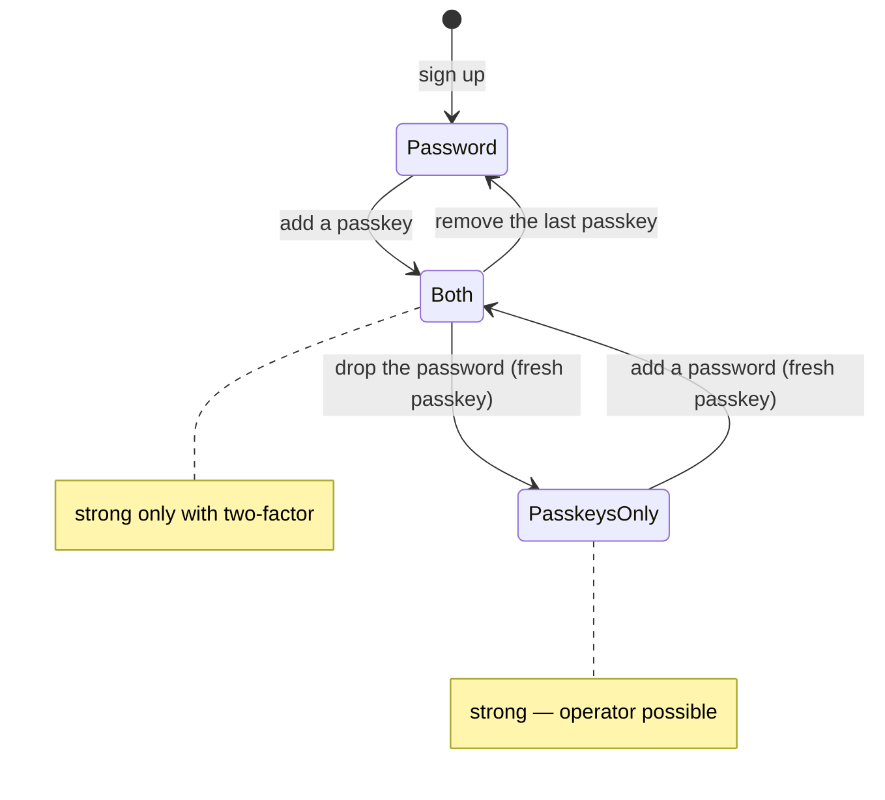

# Feature Specification: Passkeys

**Feature Branch**: `016-passkeys`
**Created**: 2026-09-30
**Status**: Implemented
**Input**: The author signs in from a computer with Bitwarden's browser extension, which keeps
passkeys; an authenticator app for codes is not an option for him.

## User Scenarios & Testing

### User Story 1 — Sign in with a passkey (P1)

1. **Given** a signed-in person, **When** she adds a passkey in Mon espace Kete → Sécurité,
   **Then** her password manager or device keeps it.
2. **Given** a passkey, **When** she chooses "Se connecter avec une clé d'accès", **Then** she is
   signed in — and a Kete app that sent her there gets her back, as with a password.

### User Story 2 — Passkeys only (P1)

1. **Given** at least one passkey, **When** she drops her password — right after using her
   passkey — **Then** her account signs in with passkeys only; her old password opens nothing.
2. **Given** a passkey-only account, **Then** its last passkey cannot be removed.
3. **Given** no passkey, **Then** her password cannot be dropped.
4. **Given** a passkey-only account, **When** she adds a password in Sécurité — right after using
   her passkey — **Then** she can sign in with it where no passkey is offered (a browser without
   her password manager); the screen warns her that her account no longer signs in strongly until
   she turns on two-factor. An account that has a password cannot add another one this way.

### User Story 3 — Strong enough to run Kete (P1)

1. **Given** a passkey-only account, **Then** it signs in strongly — like two-factor: `two_factor`
   is true in Kete tokens, and an owner or admin of Kete's organization is an operator.
2. **Given** a passkey next to a password, **Then** it is not strong: the password alone still
   opens the account.
3. **Given** a strong account, **Then** no one-time sign-in link is ever issued for it (spec 013).

### User Story 4 — Operator scripts without a terminal code (P2)

1. **Given** `staging:operator` or `clients create`, **Then** they ask only the operator's e-mail,
   check that she is an operator (owner or admin of Kete, signing in strongly), act as her with a
   session they close at the end, and never use a one-time link (its verification strips the
   password of an account whose e-mail is unproven).

## Requirements

- **FR-001**: `@better-auth/passkey`; relying party: the Compte Kete's own host; migration 0007.
- **FR-002**: `src/platform/strength.ts`: `signsInStrongly` — second factor, or passkeys and no
  password; used by the claims, the operators and the sign-in links.
- **FR-003**: Removing the password: a server function, only with a passkey and a sign-in less
  than five minutes old; the last passkey of a passkey-only account is kept (a hook).
- **FR-003b**: Adding a password back (2026-10-05): `features/identity/password.ts`,
  `addPasswordFor` — Better Auth's server-only `setPassword`, with a sign-in less than five minutes
  old, refused when a password exists; 10 to 128 characters.
- **FR-004**: `scripts/operator-session.ts` for the operator scripts.
- **FR-005**: Catalogs French and English.

## Success Criteria

- **SC-001**: `tests/passkeys.test.ts` (rule, claims, operators, password, last passkey, password added back, scripts)
  and `e2e/passkeys.spec.ts` (a virtual authenticator: add, drop the password, sign in again, the
  old password refused) pass.
