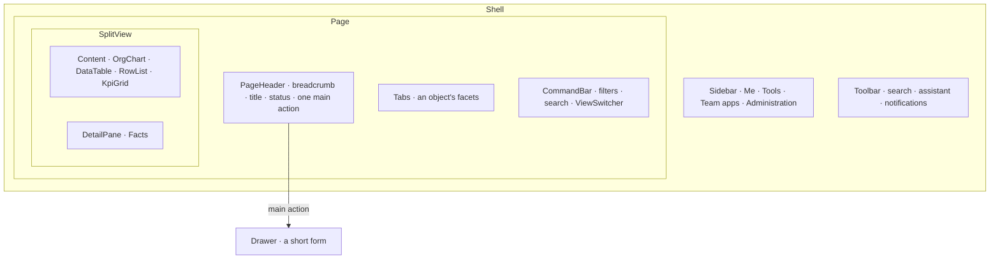

# Spec 040 — The page slots and the chat kit of the workspace design

## Why

Every page of Kete Enterprise invented its own layout from four pieces (`Shell`, `PageTitle`,
`PageSection`, `AppCard`): additions opened different interfaces in different places, and a view
had one format only. Enterprise interfaces (Microsoft 365 and Fluent 2, which the workspace design
comes from; SAP Fiori's list report and object page) share fixed slots. The assistant's chat did
not meet what people expect from Copilot, ChatGPT or Claude.

## The slots

- **A list page** is `PageHeader`, `CommandBar`, then the content; **an object page** is
  `PageHeader`, `Tabs`, then the content beside its `DetailPane`.
- **One main action** per page, in the header. A short form opens in a `Drawer` (the list stays
  visible); a long one is an object page in draft; an irreversible gesture asks in `ConfirmDialog`.
- **Several formats per view**: `ViewSwitcher` chooses chart, list, table, columns or calendar; a
  format with `href` lives in the address (`?vue=`), so it is shared and remembered.
- **`OrgChart`**: boxes joined by lines, top-down, scrolled sideways; boxes fold and unfold;
  selecting one opens it in the detail pane; a tree for assistive technology.

## The chat kit

- `ChatThread`: a log announced politely, following the last message.
- `ChatMessage`: the person's on the right; the assistant's in full width, with its author, its
  `ToolCard`s (folded results), its actions (`CopyButton`, useful, not useful, again).
- `Markdown`: headings, lists, emphasis, code, tables, links (http, https or a path only), rendered
  as elements — never as HTML.
- `Composer`: pinned at the bottom, grows to eight lines; Enter sends, Shift+Enter breaks the line;
  while an answer runs, it offers « stop ».

## Requirements

- **FR-001**: semantic tokens only (the test of base colors covers the new components).
- **FR-002**: every word comes through props; every control has an accessible name.
- **FR-003**: the template serves its client assets from its image (`--static ../client`) and
  Tailwind never scans `dist/` (`@source not`), so the server and client builds name the same
  stylesheet.
