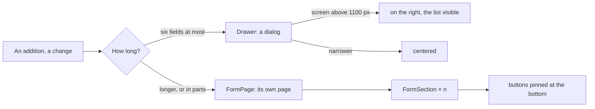

# Spec 044 — Forms in their place, and every mode

## Why

A form beside a list crowds both; long forms in a side panel overflowed. And the workspace design
was shown dark only, although its light mode exists. Decided with the author on 2026-10-03.

## The rule of forms

- **Never a list and a form on the same page.**
- `Drawer` is the dialog of a short form: on the right above 1100 px, centered below.
- `FormPage` is a long form's page: header with the way back, `FormSection`s, buttons pinned.

## Modes

- `ThemeChoice`: dark, light, automatic (the device's own), as three buttons.
- `themeFromCookies`, `themeCookie`, `applyTheme`, `THEME_COOKIE`: the choice is kept in a cookie
  for a year; the server reads it and renders `<html data-theme>` at once — no flash. Without a
  choice, each design keeps its default (workspace: dark; kete: light).
- The template applies it: its root reads the cookie, its header offers the choice.

## Also

The template trusts Kete's own packages as soon as they are published
(`minimumReleaseAgeExclude: '@kete-africa/*'`), as Kete Enterprise already does: an app upgraded
right after a release no longer fails its CI.

## Requirements

- **FR-001**: semantic tokens only; every word through props.
- **FR-002**: a dialog is named by its title; a form page's sections are named by theirs.
