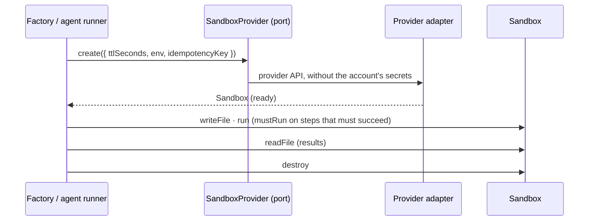

# Spec 047 — An isolated computer for agents and the app factory

## Why

Agents that run code, analyse data or browse, and the factory that codes a new app with a coding
agent, need a computer of their own — never Kete's servers, never Kete's secrets. Existing
providers rent such machines by the second (boat.dev, E2B); Kete reaches them through one port.

## Requirements

- **FR-001**: a sandbox gets only the variables its caller gives it; it stops by itself after its
  time to live (one hour by default).
- **FR-002**: the provider's name appears only in its adapter (`boatProvider`); callers use
  `SandboxProvider` and `Sandbox`.
- **FR-003**: `memoryProvider` lets every caller be tested without a real machine.
