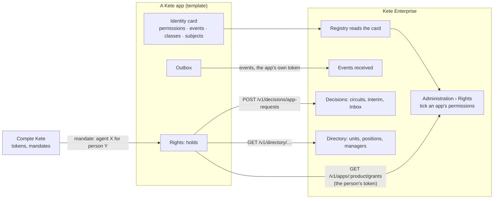

# Spec 049 — The app contract

## Why

An app enters the system through its identity card (`/.well-known/kete`) and what the center —
Kete Enterprise — answers. Spec 045 gave it tools, a read API and data sets. Five gaps remained:

1. **Its permissions** are hard-coded per Compte Kete role: nobody can tick « manage the queues »
   for the head of after-sales service without a deploy.
2. **Nothing it does is announced** to the center: agents and briefings would have to poll.
3. **Nothing says which data is secret**: a salary could reach a model or a shared briefing.
4. **An agent calling it is invisible**: it carries the person's token, so the app cannot tell, nor
   prepare a draft instead of acting, nor journal the truth.
5. **It cannot ask the center** who someone's manager is, nor for an approval by the structure's
   circuits — so every app would rebuild Frappe's workflows.

## What an app declares, what the center offers

### 1. Permissions (part 1)

- The card lists `permissions`: each with its `name` (`tickets:manage`), its `label` and
  `description` in French and English (taken from the app's catalogs), and the Compte Kete `roles`
  that hold it by default.
- Kete Enterprise reads them with the card. In Administration › Rights, a role lists them, grouped
  by app, as `<product>#<permission>` (`prd_kete_helpdesk#tickets:manage`), granted to positions with
  a scope like any other.
- The app asks `GET {center}/v1/apps/{product}/grants` with the person's token and keeps the answer
  five minutes. The answer is `managed: false` until a role of the organization carries one of the
  app's permissions: the app then keeps its defaults. Once managed, the center's answer is the
  rights. Without a center, or when it does not answer, the defaults apply.
- An agent acting for a person never holds more than the person (doctrine): the grants are hers.

### 2. Data classification (part 1)

- Each capability, data set and event declares a `classification`: `public`, `internal` (the
  default), `confidential` or `secret`.
- `secret` data never reaches a model, a shared briefing nor a notification's text: the center
  shows that it exists and links to it.

### 3. Events (part 2)

- The card lists the events the app `emits`, each with its description, classification and the
  JSON Schema of its `data`. Events carry identifiers and facts, never names nor contacts (the
  `event.v1` rule): a subscriber reads the rest at the app's API, under its own rights.
- The outbox delivers to every destination configured: Kete Cockpit (counters) and the center
  (business events). Each destination keeps its own delivery state.
- The center authenticates an app by its own Compte Kete token (`client_credentials`, scope
  `kete:events`) and accepts its events for an organization only if that organization's registry
  holds the app, by the client id its card declares.

### 4. Agent mandate (part 3)

- The Compte Kete exchanges a person's token for a **mandate** (RFC 8693 token exchange): the same
  person (`sub`), an `act` claim naming the agent, a narrower scope, ten minutes. Only the center's
  client, holding `kete:mandate`, asks for one.
- The template reads `act`: the caller becomes `{ kind: 'agent', onBehalfOf: person }`, so the
  registry of capabilities applies the agent's autonomy rules (a draft instead of an act) and the
  journal records both.

### 5. Directory and approvals (part 4)

- `@kete/center` gives the app the organization as the center knows it, with the person's token:
  her units and positions, her manager, a unit's people.
- An app declares the `subjects` it asks decisions for (`purchase`, with the measure's label). It
  opens a request at the center; the decisions engine finds the approver by the structure and the
  thresholds, interim included; the person decides in the Inbox. The center calls the app's
  `callback` with the request's id only, and the app reads the outcome with its own token: no
  shared secret.

## Requirements

- **FR-001**: every addition to `manifest.v1`, `capability.v1`, `dataset.v1` is optional
  (additive); an app without them behaves as before.
- **FR-002**: an app's rights never depend on the center being up: its defaults apply when the
  center is absent, silent or the app unmanaged.
- **FR-003**: the grants are read with the person's token and cached at most five minutes, per
  token.
- **FR-004**: a permission name in the card matches `^[a-z][a-z0-9_]*:[a-z][a-z0-9_]*$`; its label
  and description exist in French and English.
- **FR-005**: an app created from the template declares its permissions, their labels and the
  classification of its capabilities and data sets.
- **FR-006**: `secret` is never sent to a model by the center (its spec on apps' permissions).

## Delivered

| Part | What                                                                                       | Where                                       |
| ---- | ------------------------------------------------------------------------------------------ | ------------------------------------------- |
| 1    | Permissions with their words, classification, `@kete/center` grants, the template's rights | kete-core #49; Kete Enterprise spec 022     |
| 2    | The app's own token (`kete:center`), the directory, business events in their own outbox    | this part; Kete Enterprise specs 023, 025   |
| 3    | The agent's mandate                                                                        | this part; Kete Enterprise spec 024         |
| 4    | Decisions asked by apps                                                                    | this part; Kete Enterprise spec 023, part 2 |

### Part 2 in detail

- **The app's own token**: the Compte Kete grants `kete:center` (`client_credentials`) to the apps
  the factory registers, and to an app registered before with `pnpm clients center --client <id>`.
  `createAppToken` asks it and keeps it until a minute before it expires;
  `createAppTokenVerifier` refuses a person's token or one without the scope.
- **Business events**: `outboxMigrationSql({ name: 'kete_center_outbox' })` gives the app a second
  outbox; `announce(db, …)` records a fact in it with the change; the worker delivers it every
  minute to `{center}/public/apps/events` with the app's token, no signature, no shared key. Facts
  and identifiers only (`event.v1`): the template's `task.created` carries the task's id and day,
  never its title.
- **The directory**: `center.me(token)`, `center.person(token, userId)`, `center.unit(token, id)`.

### Part 3 in detail

- **The mandate**: `POST /api/apps/mandates` at the Compte Kete, for the center's client only
  (`kete:mandate`). It takes the person's token and the agent (`agt_…`, its name); it gives back a
  token signed with the same keys: the person's same claims, nothing added, and
  `act: { sub: agent, name, client_id: center }`. Ten minutes at most, never beyond the person's
  token; a mandate is not exchanged again.
- **Read by every app**: `@kete/auth` gives `identity.actingAgent`; the template makes the caller
  `{ kind: 'agent', id: agent, onBehalfOf: person }` — the registry of capabilities applies the
  agent's autonomy (a draft where a person would act) and the journal records both.
- **Asked by the center**: `createMandates` of `@kete/auth`, with the center's own token.

### Part 4 in detail

- **Declared**: the card's `subjects` (`purchase`, its words, the measure's words). In Kete
  Enterprise they appear as `<product>.<subject>`, for which an administrator defines a circuit.
- **Asked**: `center.requestDecision(token, { subject, reference, title, measure, unitId,
  callbackUrl })` with the person's token; `no_circuit` when the organization has none — the app
  applies its own rule.
- **Told, then read**: once decided, the center posts `{ requestId, organizationId }` to the
  callback — nothing else; the app reads the outcome with `center.decision(appToken, org, id)`.

## Out of scope here

Interactive views (spec 050), references between records (051), the unified journal (with the
events, in Kete Enterprise).
