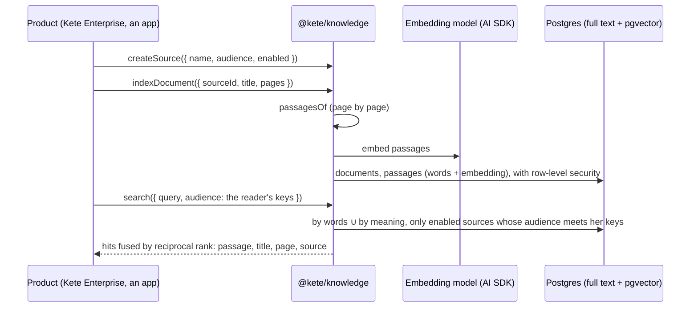

# Spec 052 — The company's knowledge, with its sources

## Why

« What does our procedure say about a customer complaint? » An assistant of this era answers from
the company's own documents, cites where it read, and never shows a person what she may not read.
Every Kete app and Kete Enterprise need the same foundation; it is built once, here, on what exists.

## Requirements

- **FR-001**: `knowledgeMigrationSql` creates sources, documents and passages, each with its
  row-level security in the same migration; pgvector in `public`.
- **FR-002**: a source has an audience (keys chosen by the product) and can be switched off; a
  search reads only enabled sources whose audience meets the reader's keys.
- **FR-003**: `indexDocument` cuts a document page by page (LangChain's recursive splitter),
  embeds the passages through an `Embedder` (`aiEmbedder` over the AI SDK), keeps an unchanged
  document as it is and replaces a new version.
- **FR-004**: `search` fuses full-text and vector rankings (reciprocal rank, k = 60) and returns,
  for each hit, the passage, the document's title, its page, its source.
- **FR-005**: no vendor name: the embedding model is configuration (`@kete/ai`).

## Next

Docling as an extractor for scanned and complex documents; connectors (SharePoint, Drive) as other
kinds of sources; re-ranking when a source grows large.
