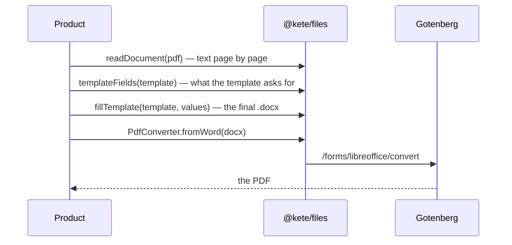

# Spec 053 — Files and final documents

## Why

A company works with its own documents: it reads them (procedures, reports, quotes) and produces
them (letters, quotes, reports) with its own layout and logo. An assistant of this era fills the
company's template instead of inventing a layout, and gives a PDF ready to send. All of it with
existing tools: unpdf and officeparser to read (a scan by the caller's multimodal model), docxtemplater to fill Word templates, Gotenberg to turn
Word, HTML or Markdown into PDF.

## Requirements

- **FR-001**: `readDocument` reads PDF (page by page), Word, Excel (sheet by sheet), PowerPoint
  (slide by slide), OpenDocument, RTF, text, CSV, Markdown, JSON; `readable`.
- **FR-001b**: a scan — an image, or a PDF whose pages hold almost no text — goes to the caller's
  `transcribe` port; `@kete/ai`'s `scanReader(model)` is one, metered. Without it, an image stays an
  image. officeparser's own OCR (Tesseract) is not used: a multimodal model reads scans better.
- **FR-001c**: `readSheets` reads a workbook or a CSV as grids of text; `readTable` types a sheet
  (numbers in French or English notation, days, texts) for a product to store and chart.
- **FR-002**: `templateFields` lists a template's fields; `fillTemplate` fills it, a missing value
  empty; `TemplateError` for a file that is not a template.
- **FR-003**: `PdfConverter` port; `gotenbergConverter` (Word, HTML, Markdown); `pdfConverterFromEnv`
  (`KETE_GOTENBERG_URL`), null without it.
