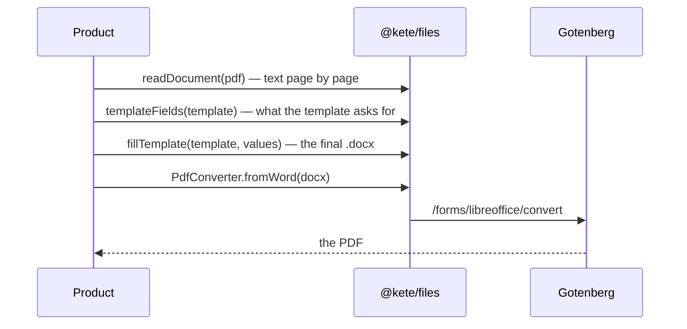

# Spec 053 — Files and final documents

## Why

A company works with its own documents: it reads them (procedures, reports, quotes) and produces
them (letters, quotes, reports) with its own layout and logo. An assistant of this era fills the
company's template instead of inventing a layout, and gives a PDF ready to send. All of it with
existing tools: unpdf and mammoth to read, docxtemplater to fill Word templates, Gotenberg to turn
Word, HTML or Markdown into PDF.

## Requirements

- **FR-001**: `readDocument` reads PDF (page by page), Word, text, CSV, Markdown, JSON; `readable`.
- **FR-002**: `templateFields` lists a template's fields; `fillTemplate` fills it, a missing value
  empty; `TemplateError` for a file that is not a template.
- **FR-003**: `PdfConverter` port; `gotenbergConverter` (Word, HTML, Markdown); `pdfConverterFromEnv`
  (`KETE_GOTENBERG_URL`), null without it.
