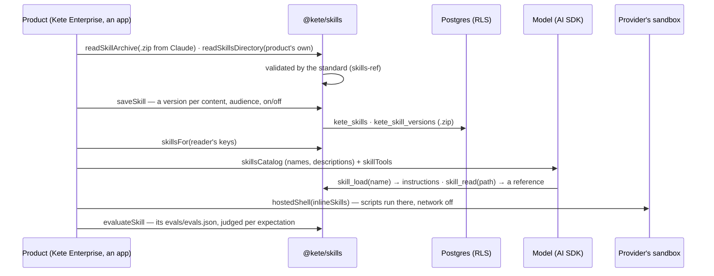

# Spec 054 — Skills

## Why

« Write to a client the way we write. » In 2026 an organization's know-how reaches a model as
**Agent Skills** (agentskills.io, Anthropic, December 2025, adopted by OpenAI, Google, Microsoft and
the main agent tools): a folder whose `SKILL.md` says what the skill does, when to use it and how,
beside its references, templates and scripts. A skill written once works in Claude, ChatGPT, Codex
and here; what a product used to hard-code (« summarize », « write the letter », « make the Excel »)
becomes a skill its organization reads, changes and shares. Built on what exists: the standard's
reference library (`skills-ref`) to read and validate, fflate for the .zip the tools exchange, the
AI SDK for the tools and the provider's sandbox.

## Requirements

- **FR-001**: `parseSkill`, `readSkillArchive`, `readSkillsDirectory`, `skillFromText` read a skill
  and validate it by the standard (name, description, known fields, folder = name); `SkillError`
  lists every problem. Paths stay inside the skill; 10 MB and 500 files at most.
- **FR-002**: `skillVersion` is the hash of the files; `skillArchive` gives the .zip Claude, ChatGPT
  and providers take.
- **FR-003**: `skillsMigrationSql` creates skills and their versions, each with its row-level
  security in the same migration; `saveSkill` keeps a version once and makes it current;
  `updateSkill` changes the audience, switches off, brings a version back; `skillsFor` gives a
  reader the enabled skills her keys open.
- **FR-004**: progressive reading: `skillsCatalog` (names and descriptions), `skillTools`
  (`skill_load`, `skill_read`), independent of the provider.
- **FR-005**: scripts run only in a sandbox: `inlineSkills` + `@kete/ai`'s `hostedShell` (the
  provider's container, network off unless domains are allowed); `null` when the provider has none.
- **FR-006**: `skillCases` reads `evals/evals.json` (skill-creator's format); `evaluateSkill` asks
  each case with the skill offered and a judge rules on each expectation, metered.
- **FR-007**: no vendor name in the package: the provider is configuration (`@kete/ai`).

## Next

Anthropic's code execution as a second sandbox; skills exposed to MCP clients as prompts; a skill
proposed from a conversation (the product's part).
