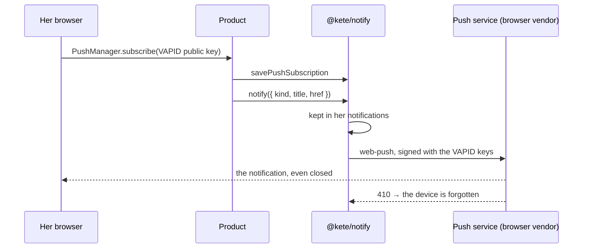

# Spec 055 — Channels: notifications in the product and on devices

## Why

« A decision waiting reaches its person's phone. » A product tells a person what happened in her
list of notifications, and on her phone or computer even when the product is closed — with the
browsers' own standard (Web Push), not a vendor. WhatsApp comes later, behind the chat channels port.

## Requirements

- **FR-001**: `notificationsMigrationSql` — notifications and push subscriptions, row-level security.
- **FR-002**: `notify` keeps the notification and sends it to each device; `listNotifications`,
  `unreadCount`, `markRead`.
- **FR-003**: `PushSender` port; `webPushSender` (web-push, VAPID), `pushSenderFromEnv`,
  `memoryPushSender` for tests; a device answering 404 or 410 is forgotten.
- **FR-004**: a notification informs; actions stay in the product's « To do ».
