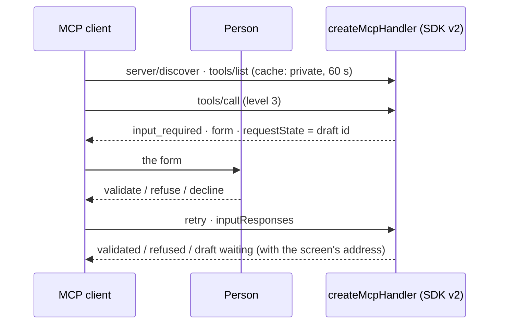

# Spec 059 — MCP 2026-07-28

## Why

The MCP specification of 2026-07-28 makes the protocol stateless, replaces server-initiated
requests by multi-round-trip results (`input_required`), adds cache hints and server discovery, and
the official TypeScript SDK v2 ships with it. Claude, ChatGPT and Codex speak it. Every Kete product
serves its capabilities through `@kete/capabilities`' MCP endpoint: it moves to SDK v2, keeps 2025
clients working, and uses the new round trip for what the doctrine already asks — **a person decides
a draft, never the model**.

## Requirements

- **FR-001**: `@kete/capabilities` serves MCP with `@modelcontextprotocol/server` 2.x
  (`createMcpHandler`, stateless, one JSON answer per request), for 2026-07-28 and 2025-era clients.
- **FR-002**: `tools/list`, `resources/list`, `resources/read` carry private cache hints.
- **FR-003**: a level 3 draft prepared for a person, through a 2026-07-28 client that declared form
  elicitation, is put to her as an `input_required` form; her answer decides it through
  `registry.decide` (her rights, channel `view`, journaled); a decline leaves it waiting. Level 4 is
  never decided there; an agent acting for nobody is never asked.
- **FR-004**: `@kete/views` uses `@modelcontextprotocol/ext-apps` 2.x; the template's tests use the
  v2 client.

## Next

The Tasks extension for long agent tasks; skills exposed to MCP clients (spec 054).
