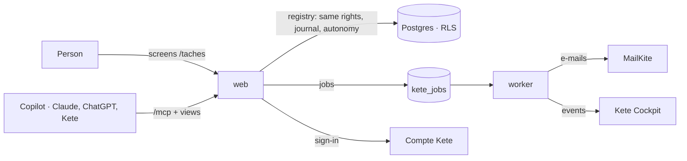

# App template

A Kete App, born complete: it signs people in with the Compte Kete, keeps each organization's data
apart, journals every gesture, lets agents prepare and people decide — on its screens and in their
copilot (MCP Apps) — sends its e-mails and events from a worker, and passes CI on its first commit.



## Run locally

```bash
pnpm install
cp .env.example .env   # then fill it: database, Compte Kete registration, session secret
pnpm db:migrate
pnpm dev               # http://localhost:3400
pnpm worker            # in another terminal: e-mails and events
```

## Test

```bash
pnpm test              # a Neon "test" branch, or KETE_TEST_POSTGRES=container
pnpm typecheck
```

## Deploy

One image, two roles (doctrine ARCHITECTURE_APP §9): the web process (`pnpm start`, migrations at
start-up) and the worker (`pnpm worker`). An operator registers the app at the Compte Kete
(client id and secret) and declares it in Kete Cockpit (its events key).

## Make it yours

1. Name it in `kete.json` and `messages/` (`app_name`).
2. Replace `src/features/tasks` with the first real feature, keeping its layers.
3. Choose its design in `src/platform/app.ts` — `kete`, `workspace`, or its own (`design/`).
